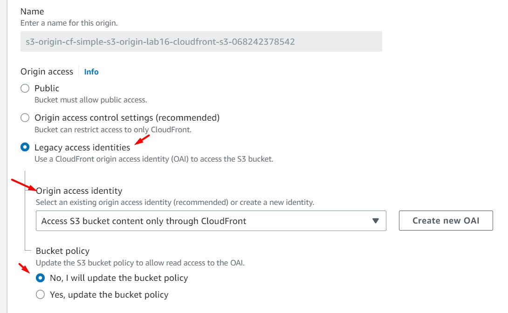

# AWS Solutions Architect Associate - Laboratorio 16

<br>

### Objetivo: 
* Restringir el acceso al contenido de S3 usando OAI (Origin Access Identities) en CloudFront 


### Tópico:
* Storage
* Content Delivery

### Dependencias:
* Ninguna

<br>

---

### A - Restringir el acceso al contenido de S3 usando OAI (Origin Access Identities) en CloudFront 


<br>

1. Acceder al servicio AWS Cloud9 y generar un nuevo (encender nuestro) ambiente de trabajo (Ubuntu 18.04 LTS)

2. Ejecutar los siguinentes comandos en nuestro Cloud9

```bash
#Ubuntu 18.04
sudo apt-get update
git clone https://github.com/jbarreto7991/aws-solutionsarchitectassociate.git
```

3. Acceder al laboratorio 16 (Lab-16), carpeta "code". Validar que se cuenta con un archivo CloudFormation: "1_lab16-cloudfront-s3.yaml" y un folder de nombre "2_lab16-s3-htmlresources". Analizar el contenido de estos elementos.

5. Desplegar la plantilla CloudFormation ejecutando AWSCLI.

    <br>
6. **1_lab16-cloudfront-s3.yaml** Esta plantilla no contiene parámetros de despliegue. Después del despliegue analizar los recursos aprovisiones: un bucket S3 y una distribución CloudFront. 

```bash
aws cloudformation create-stack --stack-name lab16-cloudfront-s3 --template-body file://~/environment/aws-solutionsarchitectassociate/Lab-16/code/1_lab16-cloudfront-s3.yaml 
```

7. Movemos los archivos que se encuentran en la carpeta Lab-16/code/2_lab16-s3-html-resources al nuevo bucket generado por CloudFormation.

```bash
cd ~/environment/aws-solutionsarchitectassociate/Lab-16/code/2_lab16-s3-html-resources
BUCKET=$(aws s3 ls | sort -r | awk 'NR ==1 { print $3 }')
echo $BUCKET
aws s3 sync . s3://$BUCKET
```

8. Ingresamos al servicio Amazon CloudFront, luego identificamos la distribución CloudFront generada y copiamos el valor del "Domain name". Accederemos a esta ruta a través del navegador web. Visualizaremos el contenido de nuestra página estática.

<br>


<br>


<br>

9. Desde Cloud9, realizamos modificaciones en el archivo index.html (línea 59, guardar con CTRL+S). Movemos este cambio a nuestro bucket de S3.

```bash
cd ~/environment/aws-solutionsarchitectassociate/Lab-16/code/2_lab16-s3-html-resources
BUCKET=$(aws s3 ls | sort -r | awk 'NR ==1 { print $3 }')
echo $BUCKET
aws s3 sync . s3://$BUCKET
```

10. Accedemos nuevamente a la dirección URL generada por CloudFront. Validaremos que nuestro cambio realizado no se visualiza. Ejecutamos la siguiente invalidación a través de AWSCLI. Reemplazar el valor $DistributionID por el correcto. Luego de la ejecución de la invalidación visualizaremos el cambio de nuestra aplicación desde el navegador.

```bash
aws cloudfront create-invalidation --distribution-id $DistributionID --paths "/*"

#Ejemplo
aws cloudfront create-invalidation --distribution-id E8XMV1O9QX83H --paths "/index.html"
```

<br>


<br>


<br>


<br>


<br>


11. Identificar el componente OAI  (Origin Access Identities) en las siguientes características:

    * CloudFront > Distributions > $DISTRIBUTIONID > Edit origin

<br>



<br>

    * S3 > Bucket S3 > Permissions > Bucket Policy

<br>


<br>

12. Identificación del compoenente TTL en la distribución CloudFront (CloudFront > Distributions > $DISTRIBUTIONID > Edit behavior > "Cache key and origin requests")

<br>


<br>


### Eliminación de recursos

```bash
aws cloudformation delete-stack --stack-name lab16-cloudfront-s3
```

---

### Enlaces

 - https://docs.aws.amazon.com/AmazonCloudFront/latest/DeveloperGuide/UpdatingExistingObjects.html