# AWS Solutions Architect Associate - Laboratorio 18

<br>

### Objetivo: 
* Despliegue de una distribución CloudFront con dominio personalizado usando Route53 y certificado SSL/TLS con Certificate Manager

### Tópico:
* Content Delivery
* Security, Identity & Compliance

### Dependencias:
* Implementación del Laboratorio 17

<br>

---

### A - Despliegue de una distribución CloudFront con dominio personalizado usando Route53 y certificado SSL/TLS con Certificate Manager

<br>

1. Accedemos al servicio Route 53 y validamos nuestro dominio. En este laboratorio nuestro dominio es "jorge-barreto.com"

<br>


<br>

2. Accedemos al servicio "AWS Certificate Manager" y damos clic en el botón "Request". Luego seleccionar la opción "Request a public certificate" y dar clic en el botón "Next". Ingresamos los siguientes valores y damos clic en el valor "Request".

    * Fully qualified domain name:
        * jorge-barreto.com
        * *.jorge-barreto.com

<br>


<br>


<br>


<br>

3. El estado inicial del certificado será "Pending validation". Accedemos al detalle del certificado e identificamos los valores de "CNAME name" y "CNAME value". Para este laboratorio se tienen los siguientes valores:

    * CNAME name:  _17b909f502f31737fa2b547e34f271c0.jorge-barreto.com.
    * CNAME value: _22e8d4480e5f1d14787e3efc59cc491e.wsqgzrdths.acm-validations.aws.

<br>


<br>


<br>


4. Accedemos al servicio Route 53 y al dominio existente. Luego, damos clic en "Create record". Ingresamos los siguientes valores:

    * Record name: _17b909f502f31737fa2b547e34f271c0
    * Record type: CNAME
    * Alias: Desactive
    * Value: _22e8d4480e5f1d14787e3efc59cc491e.wsqgzrdths.acm-validations.aws.
    * TTL(seconds): 300 
    * Routing Policy: Simple

<br>


<br>


<br>

5. Regresamos al servicio AWS Certificate Manager y validamos que el nuevo estado de certificado es "Issued" 

<br>


<br>

6. Ingresamos a nuestra distribución CloudFront, luego a la sección "General" y en la subsección "Settings" damos clic en el botón "Edit".  Agregar/seleccionar información en los siguientes items. Guardar los cambios. CloudFront desplegará nuestros cambios en los Regional Edge Caches y Edge Location

    * Alternate domain name (CNAME) - optional: cloudfront.jorge-barreto.com (subdominio a ser utilizado en este laboratorio)
    * Custom SSL certificate - optional: Seleccionar certificado generado previamente.

<br>

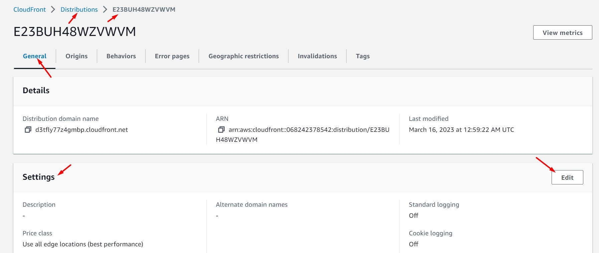

<br>


<br>

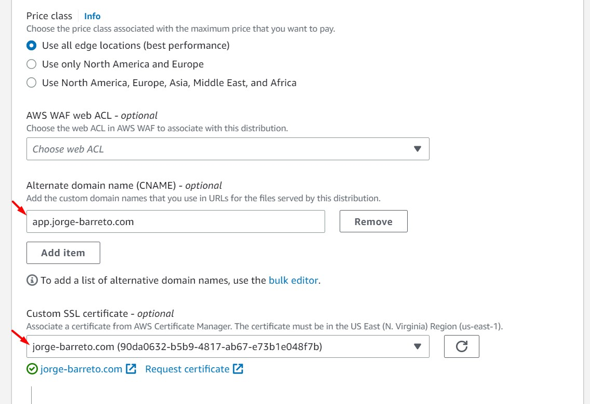

<br>


<br>


<br>

7. Ingresamos a Route 53, generamos un nuevo "Record" tipo "A - Alias". Guardamos los cambios.

    * Record name: Agregamos el mismo subdominio indicado en CloudFront. Para este ejemplo "cloudfront.jorge-barreto.com"
    * Record type: A
    * Alias: On
    * Route traffic to: Alias to CloudFront distribution
    * Agregar el dominio de nuestra distribución CloudFront, por ejemplo: diu952y35t7z7.cloudfront.net.
    * Routing policy: Simple routing

<br>

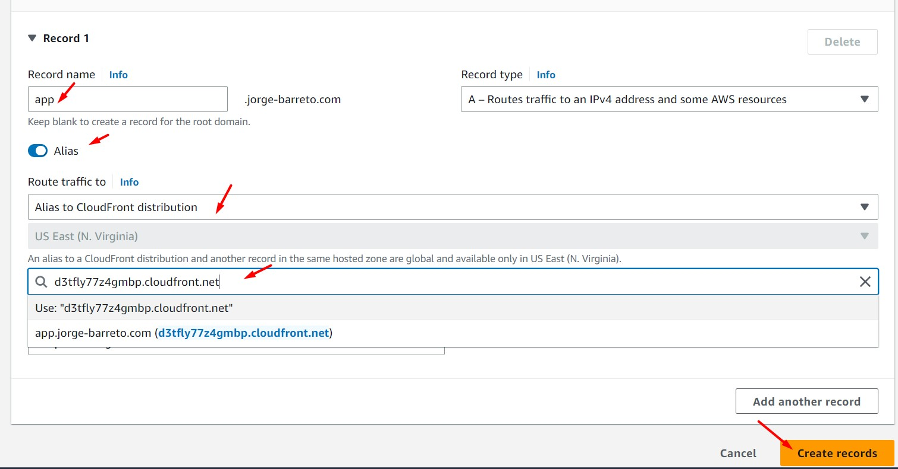

<br>

8. Si testeamos nuestra aplicación visualizaremos problemas en su carga. Necesitamos consumir nuestro balanceador de aplicaciones usando HTTPS.

9. Generamos un nuevo registro para nuestro balanceador de aplicaciones desde Route 53. Guardamos el registro.

    * Record name: app.jorge-barreto.com
    * Record type: A
    * Alias: On
    * Route traffic to: Alias to Application and Classic Load Balancer
    * Seleccionar la región "us-east-1"
    * Agregar el dominio de nuestra distribución CloudFront, por ejemplo: ec2applicationloadbalancer-701522348.us-east-1.elb.amazonaws.com.
    * Routing policy: Simple routing


<br>

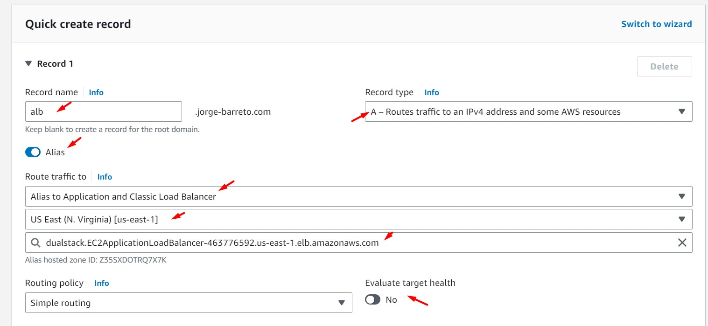

<br>

10. Ingresamos al servicio EC2, sección "Load Balancers", luego a "Listeners" y agregamos un nuevo "Listener HTTPS". Es válido también configurar un redirect de HTTP a HTTPS en las reglas correspondiente al listener HTTP


<br>

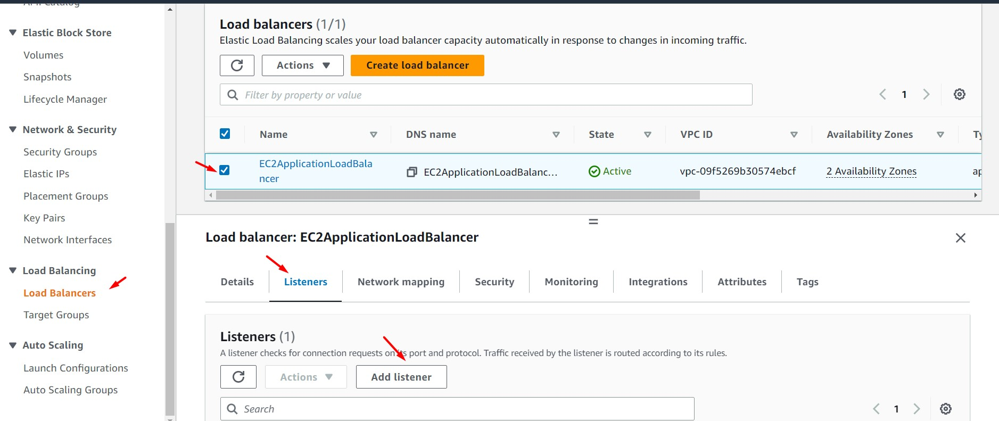

<br>

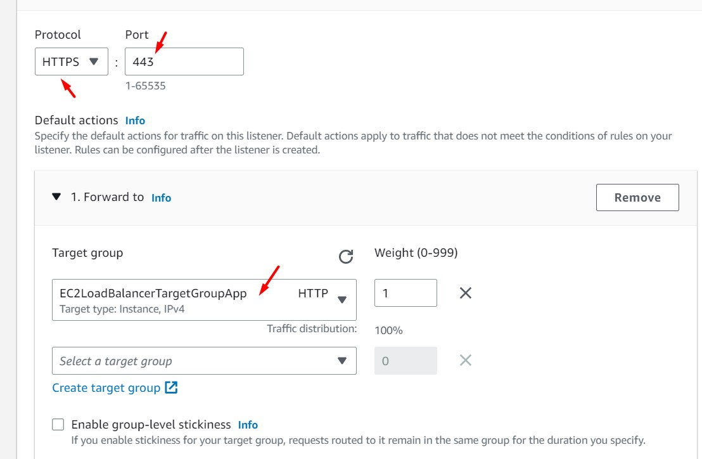

<br>

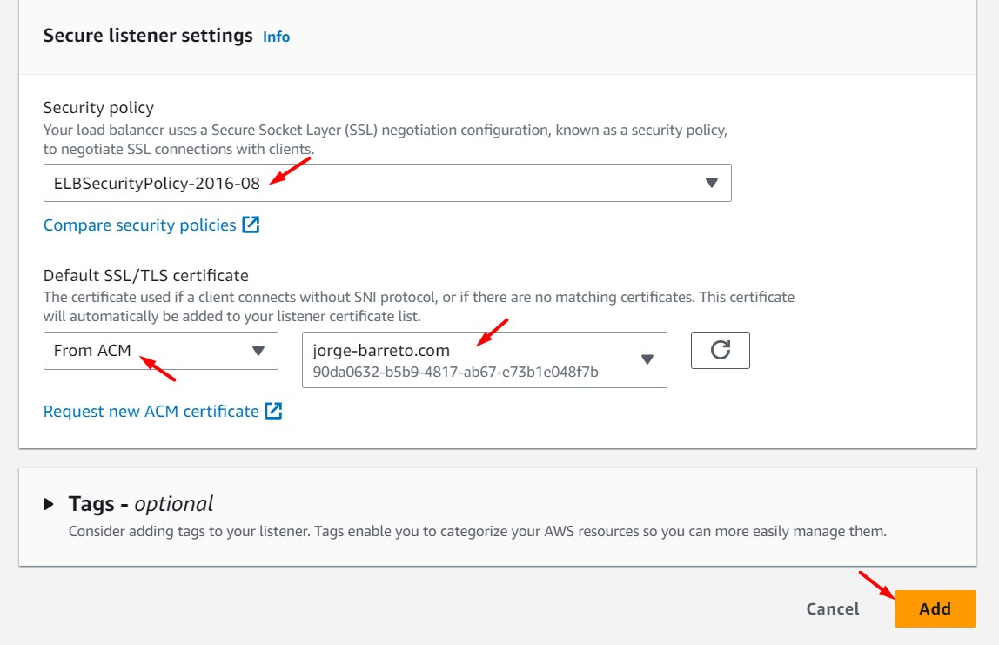

<br>

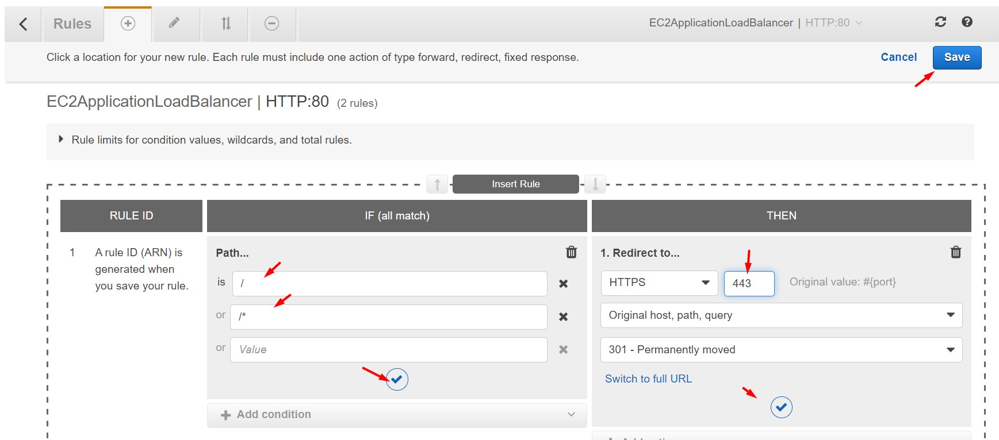

<br>

11. Ingresamos a la instancia EC2 BACKEND PROD vía "System Manager - Session Manager" y modificamos el archivo /opt/aws-solutionsarchitectassociate/App/frontend/src/config/axios.js. Reemplazaremos el valor del DNS Name del ALB por el valor registrado en Route 53 (app.jorge-barreto.com). Luego, enviamos estos cambios a S3 e realizamos una invalidación desde CloudFront (identificar previamente el "Distribution ID").

```bash
nano /opt/aws-solutionsarchitectassociate/App/frontend/src/config/axios.js
#Reemplazamos el valor "baseURL"
npm run build
cd /opt/aws-solutionsarchitectassociate/App/frontend/build/
BUCKET=$(aws s3 ls | sort -r | awk 'NR ==1 { print $3 }')
echo $BUCKET
aws s3 sync . s3://$BUCKET
aws cloudfront create-invalidation --distribution-id $DistributionID --paths "/*"
```

<br>

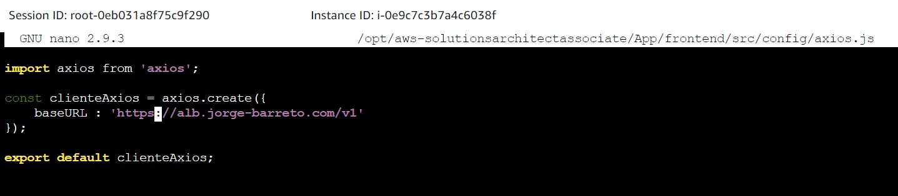

<br>

12. Ingresamos a nuestra aplicativo (https://cloudfront.jorge-barreto) y validamos la carga de la página usando el certificado previamente generado.

<br>

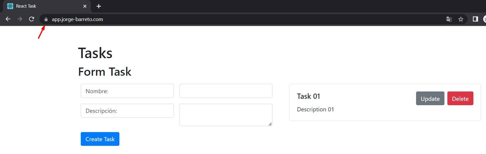

<br>

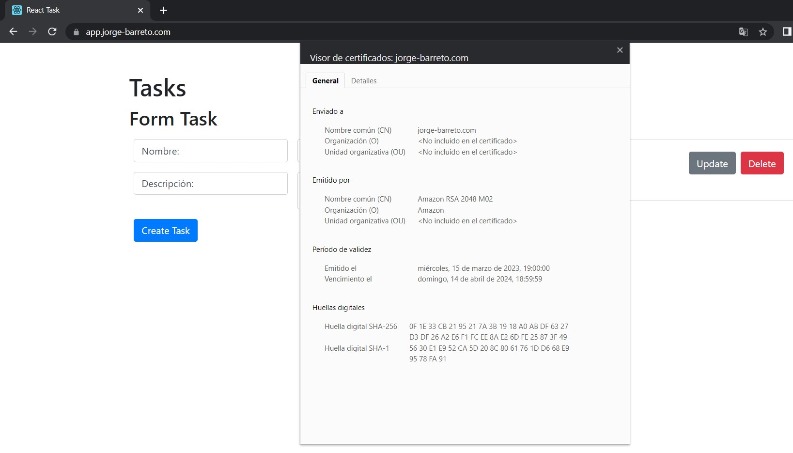

<br>