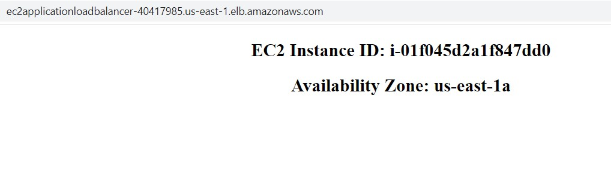
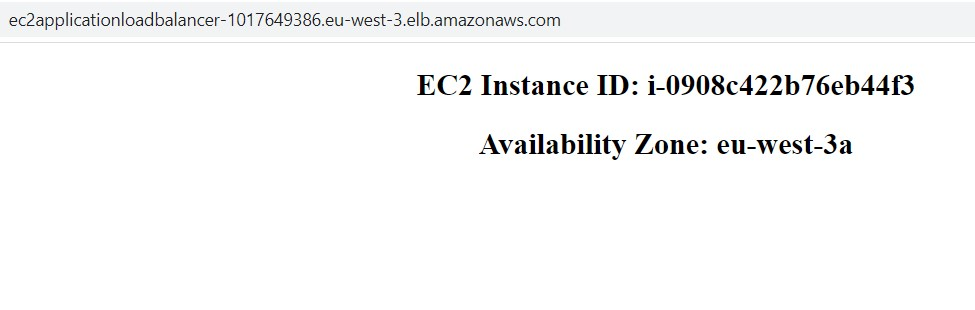

# AWS Solutions Architect Associate - Laboratorio 19

<br>

### Objetivo: 
* Configuración de los "Routing Policies Latency & Weighted" en Route 53

### Tópico:
* Networking
* Content Delivery

### Dependencias:
* Será necesario contar con un Dominio creado en Route53

### Costo:
* El uso de Route 53 tiene un costo asociado.

<br>

---

### A - Configuración de los "Routing Policies Latency & Weighted" en Route 53

<br>

1. Generar Keys Pair en las regions de **N.Virginia (us-east-1)** y **Paris (eu-west-3)**. De no ser así, acceder al servicio EC2 y luego a la opción "Key Pair" de cada región indicada. Generar llave RSA y .pem. En este laboratorio se usarán las llaves "nvirginia" y "paris" 

2. Acceder al servicio AWS Cloud9 en N.Virginia y generar un nuevo ambiente de trabajo (Ubuntu 18.04 LTS)

3. Ejecutar los siguientes comandos en nuestro Cloud9

```bash
#Ubuntu 18.04
sudo apt-get update
git clone https://github.com/jbarreto7991/aws-solutionsarchitectassociate.git
```

4. Acceder al laboratorio 19 (Lab-19), carpeta "code". Validar que existe el archivo 1_lab19-vpc-ec2-alb.yaml Analizar el contenido de este archivo.

5. Desplegar esta plantilla de CloudFormation en la región de N. Virginia y Paris, ejecutando AWSCLI. Considerar los parámetros a ser ingresados.

    <br>
6. **1_lab19-vpc-ec2-alb.yaml**. En la sección "ParameterValue", reemplazar el nombre del KeyPair creado en el paso 1. Esta plantilla creará una VPC, 02 subnets públicas, 02 subnets privadas dentro de este CIDR, un NAT Instances y demás componentes de red. No deberán existir redes existentes en este rango de IPs. Validar la creación del Stack desde la consola AWS a través del servicio AWS CloudFormation en las regiones de N.Virginia y Paris. El siguiente comando considera los valores de "nvirginia" y "paris" para el KeyPair, reemplazar el nombre según la llave respectiva.

```bash
aws cloudformation create-stack --stack-name lab19-vpc-ec2-alb-nvirginia --template-body file://~/environment/aws-solutionsarchitectassociate/Lab-19/code/1_lab19-vpc-ec2-alb.yaml --parameters ParameterKey=KeyPair,ParameterValue="nvirginia" --capabilities CAPABILITY_IAM --region us-east-1

aws cloudformation create-stack --stack-name lab19-vpc-ec2-alb-paris --template-body file://~/environment/aws-solutionsarchitectassociate/Lab-19/code/1_lab19-vpc-ec2-alb.yaml --parameters ParameterKey=KeyPair,ParameterValue="paris" --capabilities CAPABILITY_IAM --region eu-west-3

```

7. Desplegados los recursos en ambas regiones, acceder al DNS Name del balanceador de aplicaciones de cada región. Accederemos al contenido de nuestro servicio.

<br>



<br>



<br>


8. Accedemos al servicio de Route53


### Eliminación de recursos

```bash
aws cloudformation delete-stack --stack-name lab19-vpc-ec2-alb-nvirginia --region us-east-1
aws cloudformation delete-stack --stack-name lab19-vpc-ec2-alb-paris --eu-west-3

```