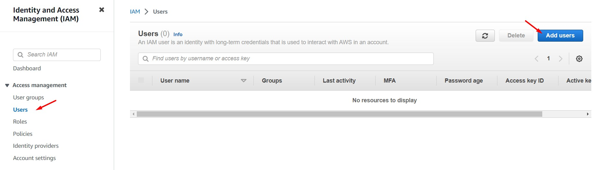
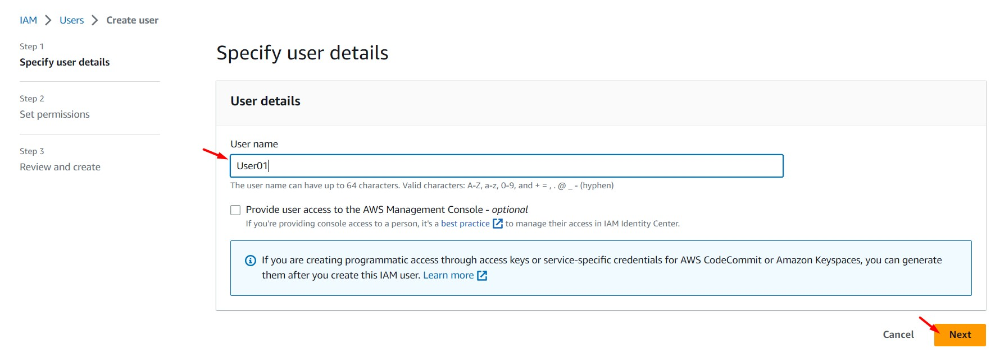
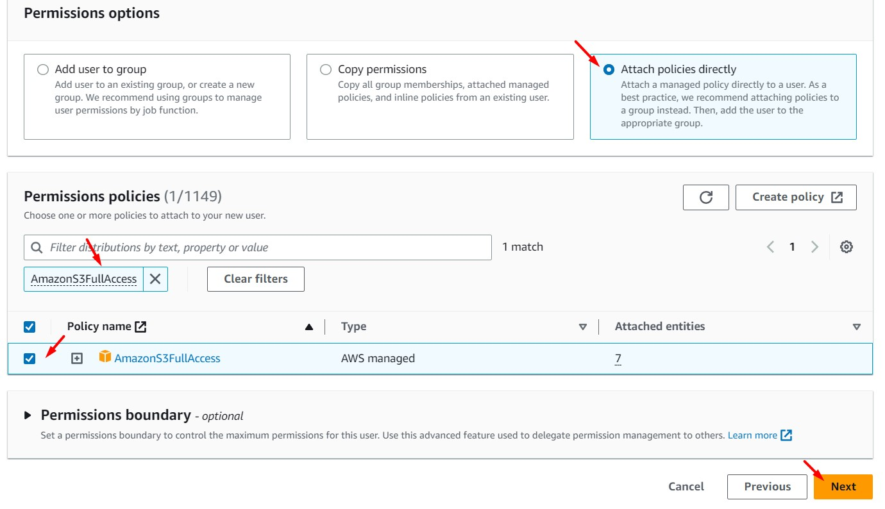
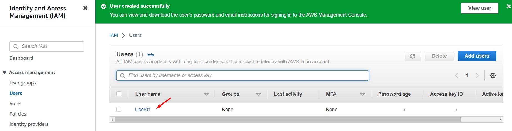
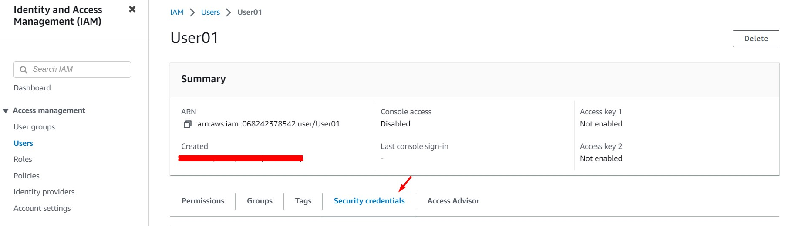
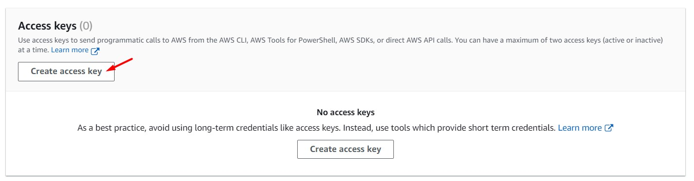

# AWS Solutions Architect Associate - Laboratorio 21

<br>

### Objetivo: 
* Evaluando niveles de permisos en IAM

### Tópico:
* Security,Identity & Compliance

### Dependencias:
* Ninguna

<br>

---

### A - Evaluando niveles de permisos en IAM

<br>

1. Hacer uso de nuestra Key Pair. De no ser así, acceder al servicio EC2 y luego a la opción "Key Pair" de cada región indicada. Generar llave RSA y .pem.

2. Acceder al servicio AWS Cloud9 y generar un nuevo ambiente de trabajo (Ubuntu 18.04 LTS)

3. Ejecutar los siguientes comandos en nuestro Cloud9

```bash
#Ubuntu 18.04
sudo apt-get update
git clone https://github.com/jbarreto7991/aws-solutionsarchitectassociate.git
```

4. **1_lab21-iam-evaluates-credentials.yaml**. En la sección "ParameterValue", reemplazar el nombre del KeyPair creado en el paso 1. Esta plantilla creará una VPC, 02 subnets públicas y demás componentes de red; además de una instancia EC2. Esta instancia instalará python3, pip3 y awscliv2, además de descargar dos archivos python en nuestra ruta de trabajo /home/ubuntu. Validar la creación del Stack desde la consola AWS a través del servicio AWS CloudFormation. En el siguiente comando, considerar reemplazar el valor del Key Pair con el valor respectivo.

```bash
aws cloudformation create-stack --stack-name lab21-iam-evaluates-credentials --template-body file://~/environment/aws-solutionsarchitectassociate/Lab-21/code/1_lab21-iam-evaluates-credentials.yaml --parameters ParameterKey=KeyPair,ParameterValue="aws-solutionsarchitectassociate" --capabilities CAPABILITY_IAM --region us-east-1
```

5. Accedemos al servicio IAM y generamos 03 "IAM User - Programmatic"  a través de la siguiente configuración. Cada usuario progrmática tendrá asociado un política distinta. En el paso final damos clic en "Create User". Luego, copiar los valores "Access key ID" y "Secret access key."

    * Username: User01
        * Select AWS credential type: Access key - Programmatic access
        * Set Permissions: Attach existing policies directly
        * Search: AmazonS3FullAccess

    * Username: User02
        * Select AWS credential type: Access key - Programmatic access
        * Set Permissions: Attach existing policies directly
        * Search: AmazonEC2FullAccess

    * Username: User03
        * Select AWS credential type: Access key - Programmatic access
        * Set Permissions: Attach existing policies directly
        * Search: IAMFullAccess

<br>



<br>



<br>



<br>


<br>



<br>



<br>



<br>

6. Accedemos por SSH a la instancia EC2 y generamos las siguientes variables de entorno con las credenciales del **user01**:

```bash
#Conexión a la instancia EC2
ssh -i keypair_name.pem ubuntu@public_ip

#Crear las siguientes variables de entorno 
export AWS_ACCESS_KEY_ID='AAAAA7Y4QB4XP2F3BBBB'
export AWS_SECRET_ACCESS_KEY='AAAAA8wg6/JP6YegqR4vPgynfXi3o6Hd+71bBBBBB'
AWS_DEFAULT_REGION='us-east-1'
echo $AWS_ACCESS_KEY_ID
echo $AWS_SECRET_ACCESS_KEY
echo $AWS_DEFAULT_REGION
```

7. Ejecutamos los siguientes comandos y analizamos los resultados. El primer comando (relacionado a S3) nos traerá la data de nuestros buckets S3, los siguientes dos comandos no serán exitosos. El comando relacionado a ec2 nos mostrará el siguiente mensaje: "An error occurred (UnauthorizedOperation) when calling the DescribeInstances operation: You are not authorized to perform this operation"

```bash
aws s3 ls
aws ec2 describe-instances --region us-east-1
aws iam list-users
```

8. Habilitar la configuración de "awscli" e ingresar las credenciales del **user02**

```bash
aws configure

#Ingresar los accesos del usuario programático 02
AWS Access Key ID [None]: AAAAA7Y4QB4XHAHBBBBB
AWS Secret Access Key [None]: AAAAAjtYNLkUu4iZ8Mkx8YmeQktuLdPRALrBBBBB
Default region name [None]: us-east-1
Default output format [None]:
```

9. Ejecutamos los siguientes comandos y analizamos los resultados. El primer comando (relacionado a S3) nos seguirá trayendo la data de nuestros buckets S3, los siguientes dos comandos seguirán no siendo exitosos.

```bash
aws s3 ls
aws ec2 describe-instances --region us-east-1
aws iam list-users
```

10. Eliminamos las variables de entorno previamente configurado y volvemos a ejecutar los comandos awscli. En el caso anterior, el comando relacionado a S3 era el único comando que traía data, en este nuevo caso el único comando que trae data es el relacionado a EC2. Al eliminar las variables de entorno las únicas credenciales válidas son las relacionadas a AWSCLI. Al permanecer las variables de entorno, AWS da prioridad a las credenciales seteadas en las variables de entorno frente a las credenciales de AWS (existe una jerarquía de evaluación).

```bash
#Variables de Entorno
unset AWS_ACCESS_KEY_ID
unset AWS_SECRET_ACCESS_KEY
unset AWS_DEFAULT_REGION
echo $AWS_ACCESS_KEY_ID
echo $AWS_SECRET_ACCESS_KEY
echo $AWS_DEFAULT_REGION

#Validación
aws s3 ls
aws ec2 describe-instances --region us-east-1
aws iam list-users
```

11. En nuestra ruta /home/ubuntu, ejecutamos el archivo 3_sdk_python_iam_without_accesskey.py. Validaremos que tendremos como respuesta errores. En el archivo 2_sdk_python_iam_with_accesskey.py deberemos reemaplazar las secciones "aws_access_key_id" y "aws_secret_access_key" con las credenciales del **user03**.

```bash
#Ejecución de archivo python
python3 3_sdk_python_iam_without_accesskey.py

#Ejecución de archivos python
python3 2_sdk_python_iam_with_accesskey.py
```

12. Al ejecutar el archivo 2_sdk_python_iam_with_accesskey.py observamos que tenemos resultados favorables. A pesar que existen otros privilegios a nivel de variables de entorno o awscli, AWS da prioridad a las credenciales hardcodeadas en el código.

13. Configuraremos un rol para nuestra instancia EC2 "IAM Challenge" y le asignaremos los permisos de "AmazonRDSFullAccess"

    * Trusted entity type: AWS Service
    * Use case: EC2
    * Permissions policies: AmazonRDSFullAccess
    * Role name: ec2_role_lab20

14. Ejecutamos los siguientes comandos y analizamos los resultados. El comando relacionado a EC2 es el comando que traerá resultados, los otros tres comandos seguirán no siendo exitosos. Procedemos a eliminar las variables de entorno y la configuración de AWSCLI.

```bash
#Validación
aws s3 ls
aws ec2 describe-instances --region us-east-1
aws iam list-users
aws rds describe-db-instances --region us-east-1

#Eliminando variables de entorno
unset AWS_ACCESS_KEY_ID
unset AWS_SECRET_ACCESS_KEY
unset AWS_DEFAULT_REGION
echo $AWS_ACCESS_KEY_ID
echo $AWS_SECRET_ACCESS_KEY
echo $AWS_DEFAULT_REGION

#Eliminación de AWSCLI
mv ~/.aws/credentials ~/.aws/bk_credentials
mv ~/.aws/config ~/.aws/bk_config
```

15. Al ejecutar nuevamente los comandos de validación confirmas que el comando relacionado a RDS tiene una respuesta, los otros tres comandos no son exitosos. El EC2 Role tiene el menor privilegio respecto a las credenciales guardas en archivos, las variables de entorno y AWSCLI.

```bash
{
    "DBInstances": []
}
```

<br>

---

### Eliminación de recursos

<br>

```bash
aws cloudformation delete-stack --stack-name lab21-iam-evaluates-credentials --region us-east-1
```