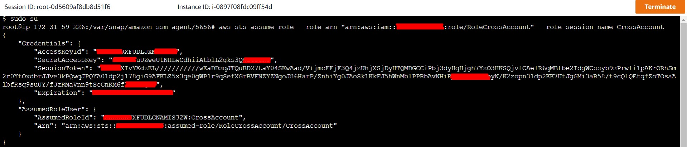

# AWS Solutions Architect Associate - Laboratorio 23

<br>

### Objetivo: 
* Entendimiento de STS (Secure Token Service)

### Tópico:
* Security,Identity & Compliance

### Dependencias:
* Implementación del Laboratorio 22

<br>

---

### A - Entendimiento de STS (Secure Token Service)

<br>

1. Desplegamos la plantilla AWS CloudFormation ubicada en /code/1_lab23-sts-crossaccount.yaml en nuestra cuenta de AWS. Debido a que hemos desplegado varias plantilla en laboratorios anteriores, no se detallará el pasa a paso de este procedimiento. Tenemos:

    * Despliegue manual a través de la consola AWS
    * Despliegue usando AWSCLI en Cloud9, en la sección "ParameterValue": 
        * Seleccionar el valor de "KeyPair", selecciónar la llave adecuada
        * Seleccionar el valor de "Subnet", ingresar el id de la subnet donde se desplegará la instancia EC2
        * Seleccionar el valor de "VPC", ingresar el id de la VPC donde se desplegará la instancia EC2 y se aprovisionará el Security Group respectivo.

```bash

#Ubuntu 18.04
sudo apt-get update
git clone https://github.com/jbarreto7991/aws-solutionsarchitectassociate.git

aws cloudformation create-stack --stack-name lab23-sts-crossaccount --template-body file://~/environment/aws-solutionsarchitectassociate/Lab-23/code/1_lab23-sts-crossaccount.yaml --parameters ParameterKey=KeyPair,ParameterValue="aws-solutionsarchitectassociate" ParameterKey=Subnet,ParameterValue="subnet-29b70f18"  ParameterKey=VPC,ParameterValue="vpc-dd59d8a0" --capabilities CAPABILITY_IAM
```

2. Accedemos vía System Manager - Session Managear a la instancia EC2 desplegada "STS Challenge" y ejecutamos el siguiente comando. Reemplazar el valor ${AWSID-DestinationAccount} por el ID de la cuenta destino (según Laboratorio anterior)

```bash
aws sts assume-role --role-arn "arn:aws:iam::${AWSID-DestinationAccount}:role/RoleCrossAccount" --role-session-name CrossAccount
```

3. Resultado del comando anterior, tendremos un JSON con la siguiente estructura. Obtenemos los siguientes valores:
    * AccessKeyId
    * SecretAccessKey
    * SessionToken

```bash
{
    "Credentials": {
        "AccessKeyId": "AAAAARJXFUDLJXMBBBBB",
        "SecretAccessKey": "AAAAAiuUZweUtNHLwCdhiiAtblL2gks3QW2BBBBB",
        "SessionToken": "AAAAAXIvYXdzEL///////////wEaDDsqJTQuBD27taY04SKwAad/V+jmcFFjF3Q4jzUhjXSjDyHTQMDGCCiPbj3dyHqHjgh7YxO3HKSQjvfCAelR6qMBfbe2IdgWCssyb9sPrwfi1pAKrORhSm2BBBBBxdbrJJve3kPQwqJPQYA01dp2j178giG9AFKLZ5x3qe0gWP1r9qSefXGrBVFNZYZNgoJ86HarP/ZnhiYg0JAoSk1KkFJ5hWnMblPPRbAvNHiBpBXNRWGitoyN/K2zopn31dp2KK7UtJgGMi3aB58/t9cQlQEtqfZoTOsaAlbfRsq9suUY/fJzRMaVnn9tSeCnKM6f79CCCCC=",
        "Expiration": "XXXX-XX-XXTXX:XX:XXZ"
    },
    "AssumedRoleUser": {
        "AssumedRoleId": "AAAAARJXFUDLGNAMBBBBB:CrossAccount",
        "Arn": "arn:aws:sts::XXXXXXXXXXXX:assumed-role/RoleCrossAccount/CrossAccount"
    }
}
```

<br>



<br>

4. Hacemos uso de AWSCLI e ingresamos los valores "AccessKeyId" y "SecretAccessKey" copiados en el paso anterior en el siguiente comando.

```bash
aws configure --profile crossaccount
```
<br>


<br>

5. Accedemos al archivo ~/.aws/credentials y agregamos la sección "aws_session_token" con el valor obtenido anteriormente. El archivo ~/.aws/credentials tendrá el siguiente contenido:

```bash
#nano ~/.aws/credentials
[crossaccount]
aws_access_key_id = AAAAARJXFUDLJXMBBBBB
aws_secret_access_key = AAAAAiuUZweUtNHLwCdhiiAtblL2gks3QW2BBBBB
aws_session_token = AAAAAXIvYXdzEL///////////wEaDDsqJTQuBD27taY04SKwAad/V+jmcFFjF3Q4jzUhjXSjDyHTQMDGCCiPbj3dyHqHjgh7YxO3HKSQjvfCAelR6qMBfbe2IdgWCssyb9sPrwfi1pAKrORhSm2BBBBBxdbrJJve3kPQwqJPQYA01dp2j178giG9AFKLZ5x3qe0gWP1r9qSefXGrBVFNZYZNgoJ86HarP/ZnhiYg0JAoSk1KkFJ5hWnMblPPRbAvNHiBpBXNRWGitoyN/K2zopn31dp2KK7UtJgGMi3aB58/t9cQlQEtqfZoTOsaAlbfRsq9suUY/fJzRMaVnn9tSeCnKM6f79CCCCC=
```

6. Asimismo accedemos al archivo ~/.aws/config y validamos que contenga la siguiente información:

```bash
#nano ~/.aws/config
[profile crossaccount]
```

7. Ejecutamos los siguientes comandos AWSCLI. El primer comando listará los buckets de la cuenta "Padre" (Cuenta que tiene configurado el AWS Organizations - Referencia: Laboratorio anterior). En el laboratorio anterior este bucket tenía por nombre "nombre-apellido-aws-account01". El segundo comando (haciendo uso del "profile") listará los buckets de la cuenta "Hija". En el laboratorio anterior este bucket tenúa por nombre "nombre-apellido-aws-account02".

```bash
aws s3 ls
aws s3 ls --profile crossaccount
```
<br>


<br>

---

### Eliminación de recursos

```bash
aws cloudformation delete-stack --stack-name lab23-sts-crossaccount
```
