# AWS Solutions Architect Associate - Laboratorio 24

 

### Objetivo: 
* Entendimiento de OU (Organizational Unit) en AWS Organizations
* Entendimiento de SCPs (Service Control Policies) en AWS Organizations

### Tópico:
* Management & Governance

### Dependencias:
* Implementación del Laboratorio 22

 

---

### A - EnEntendimiento de OU (Organizational Unit) en AWS Organizations

 

1. Ingresamos a la cuenta AWS desde donde administramos AWS Organizations. Seleccionamos la carpeta Root y luego damos clic en la opción "Actions". Seguido, damos clic en la opción Create New (Organizational Unit). Ingresamos el nombre "PROD" a nuestro "Organizational unit name" y damos clic en la opción "Create Organizational Unit". Validamos la creación de nuestra OU.

 

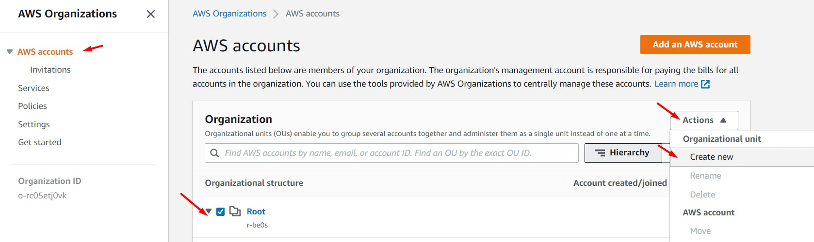

 

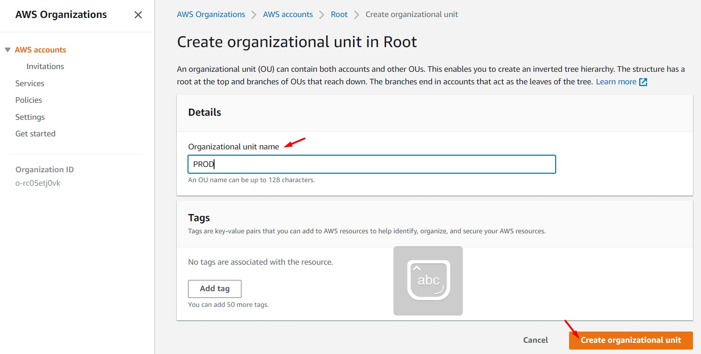

 

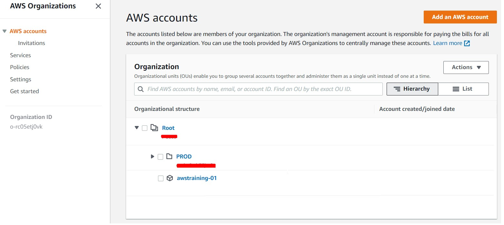

 

2. Seleccionamos nuestra cuenta "awstraining-01", damos clic en "Actions", luego en "Move (AWS Account)". Seleccionamos como destino "PROD" y damos clic en "Move AWS Account". Accedemos al OU "PROD" y validamos que nuestra cuenta forma parte del OU "PROD" 

 

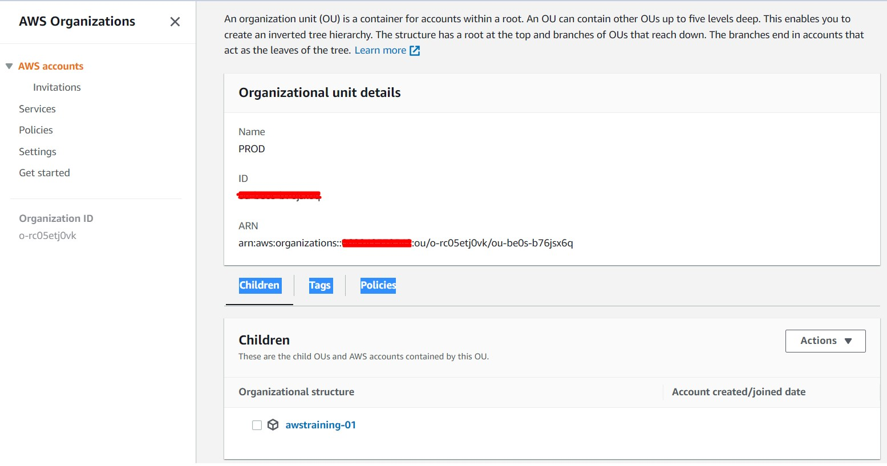

 

3. Ingresamos a la sección de "Policies", luego damos clic en la opción "Backup policies". Seguidamente en "Enable backup policies". Luego, damos clic en "Create Policy". 

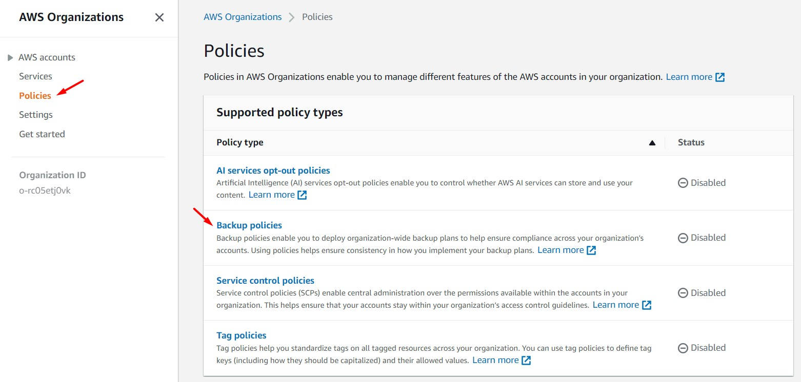

 

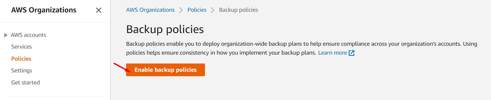

 

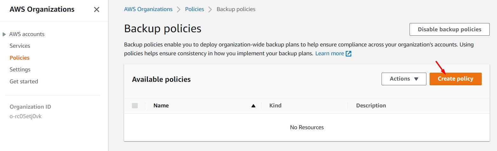

 

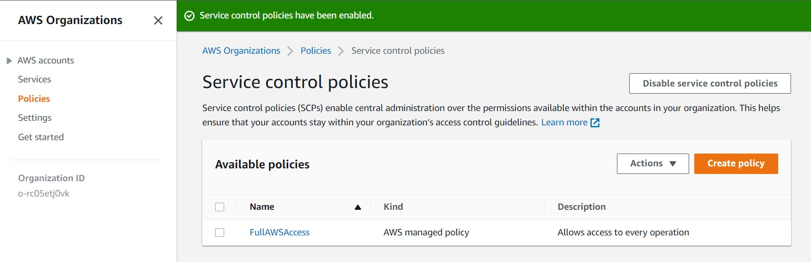

 

4. Ingresamos los siguientes valores. Luego, dar clic en el botón "Create Policy"
    * Policy name: Virginia
    * Policy: Copiar la política "1_lab24_awsorganizations_scp" almacenada en Lab-24/code. Analizar la política.

 

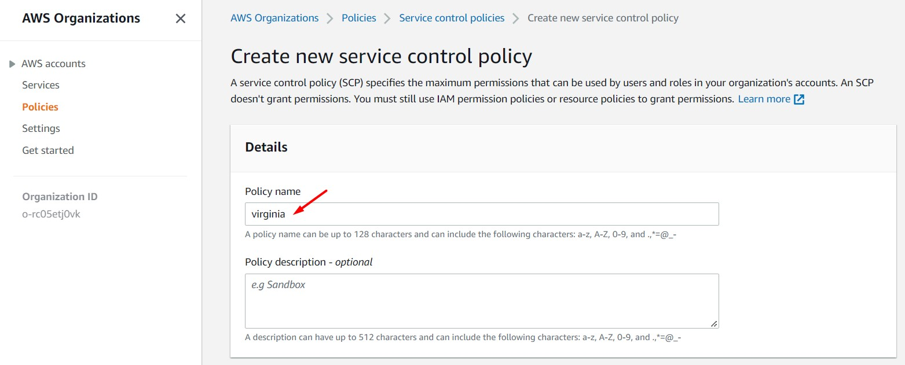

 

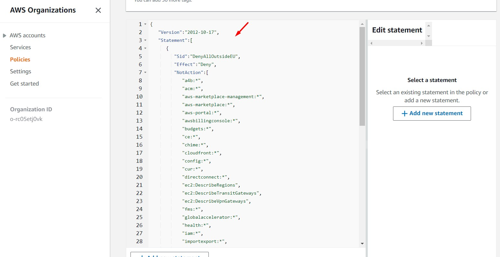

 

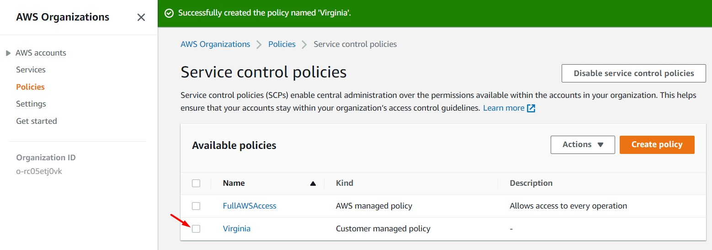

 

5. Seleccionamos la SCP "Virginia", damos clic en el botón "Actions" y seleccionamos "Attach Policy". Luego, seleccionamos nuestra cuenta AWS generada en pasos anterior ("awstraining-01") y damos clic en "Attach Policy". Si accedemos al detalle de la nueva cuenta AWS, validaremos que esta cuenta tiene asociada varias SCPs, una de ellas será el SCP "Virginia"

 

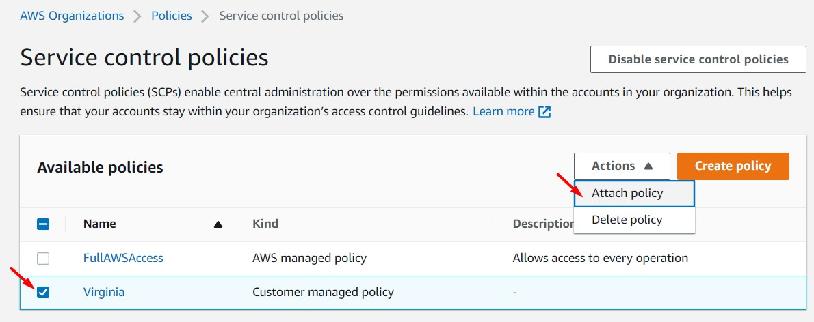

 

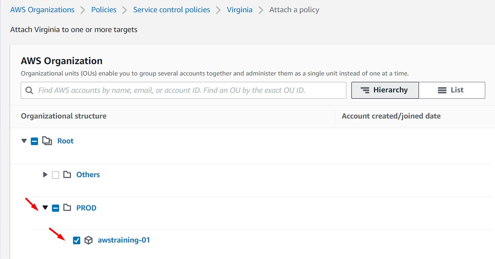

 

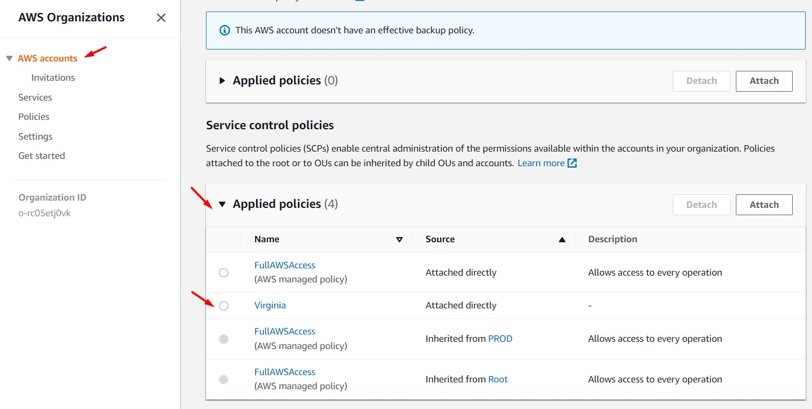

 

6. Accedemos a la cuenta "awstraining-01" e ingresamos al servicio EC2 en la región de N.Virginia. Asimismo, accedemos a la región Ohio. Validaremos que no se cuenta con permisos en la región de Ohio. La política SCP "Virginia" asociada a nivel de AWS Organizations a esta la cuenta "awstraining-01", sólo permite el uso de servicios en la región N.Virginia, todo lo demás se negará (no se incluye los servicios de naturaleza Global.

 

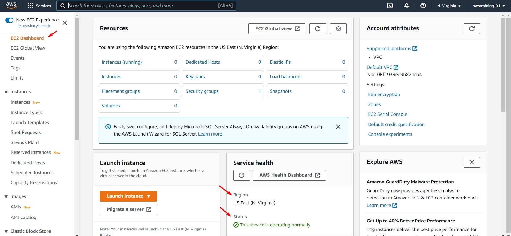

 

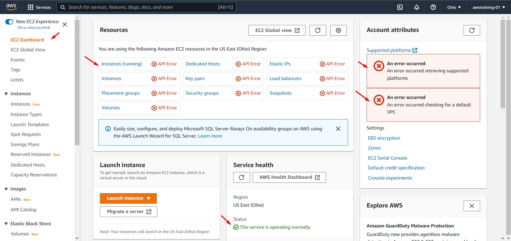

 