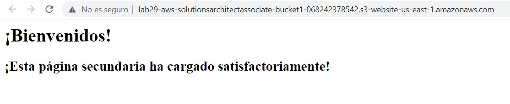

# AWS Solutions Architect Associate - Laboratorio 29

<br>

### Objetivo: 
* Configuración de CORS en S3

### Tópico:
* Storage

### Dependencias:
* Ninguna

<br>


---

### A - Configuración de CORS en S3

<br>

1. Acceder al servicio AWS Cloud9 y generar un nuevo (o encender nuestro) ambiente de trabajo (Ubuntu 18.04 LTS)

2. Ejecutar los siguinentes comandos en nuestro Cloud9

```bash
#Ubuntu 18.04
sudo apt-get update
git clone https://github.com/jbarreto7991/aws-solutionsarchitectassociate.git
```

3. Acceder al laboratorio 29 (Lab-29), carpeta "code". Validar que se cuenta con la carpeta lab29-s3-cors. Esta a su vez contendrá la plantilla de cloudformation "1_lab29-s3-cors.yaml". En esta misma carpeta encontraremos 3 simples archivos estáticos (error.html, index.html y loadpage.html). Analizar el contenido de estos elementos.

4. Desplegar la plantilla CloudFormation ejecutando AWSCLI.

    <br>
5. **1_lab29-s3-cors.yaml** Esta plantilla no contiene parámetros de despliegue. Después del despliegue analizar los recursos aprovisiones: dos buckets S3 y dos políticas basadas en recursos S3.

```bash
aws cloudformation create-stack --stack-name lab29-s3-cors --template-body file://~/environment/aws-solutionsarchitectassociate/Lab-29/code/lab29-s3-cors/1_lab29-s3-cors.yaml 
```

6. Movemos todos los archivos que se encuentran en la carpeta Lab-29/code/lab29-s3-cors/ al bucket "lab29-aws-solutionsarchitectassociate-bucket1-${AWS::AccountId}".

```bash
cd ~/environment/aws-solutionsarchitectassociate/Lab-29/code/2lab29-s3-cors/1_lab29-s3-cors/
BUCKET=$(aws s3 ls | sort -r | awk 'NR ==2 { print $3 }')
echo $BUCKET
aws s3 sync . s3://$BUCKET --include "*.html" --exclude "index2.html"
```

7. Ingresamos al servicio S3, a la propiedad "Static WebSite Hosting" del bucket "lab29-aws-solutionsarchitectassociate-bucket1-${AWS::AccountId}" y validamos la carga de nuestra aplicación.


<br>



<br>


<br>
