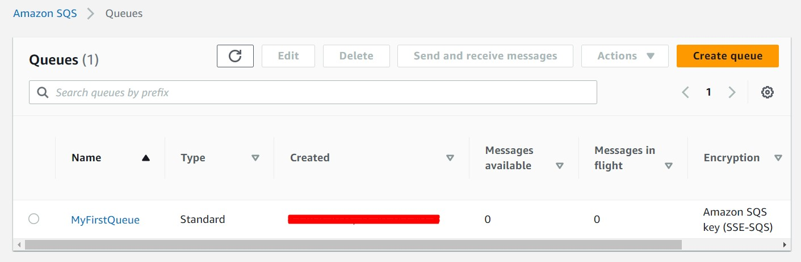
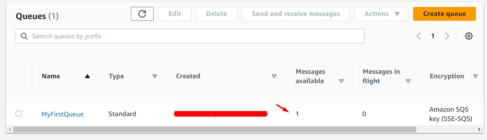
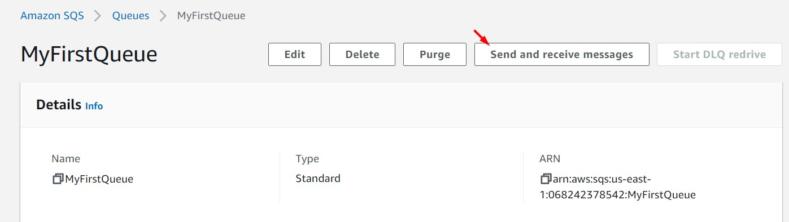
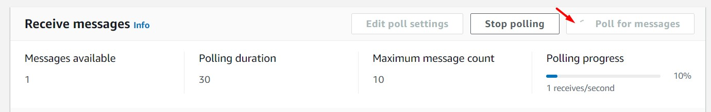
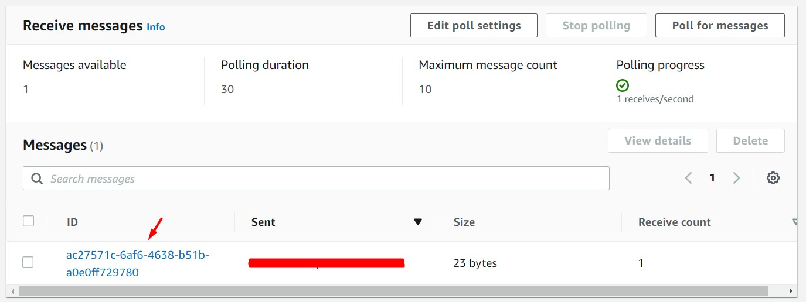
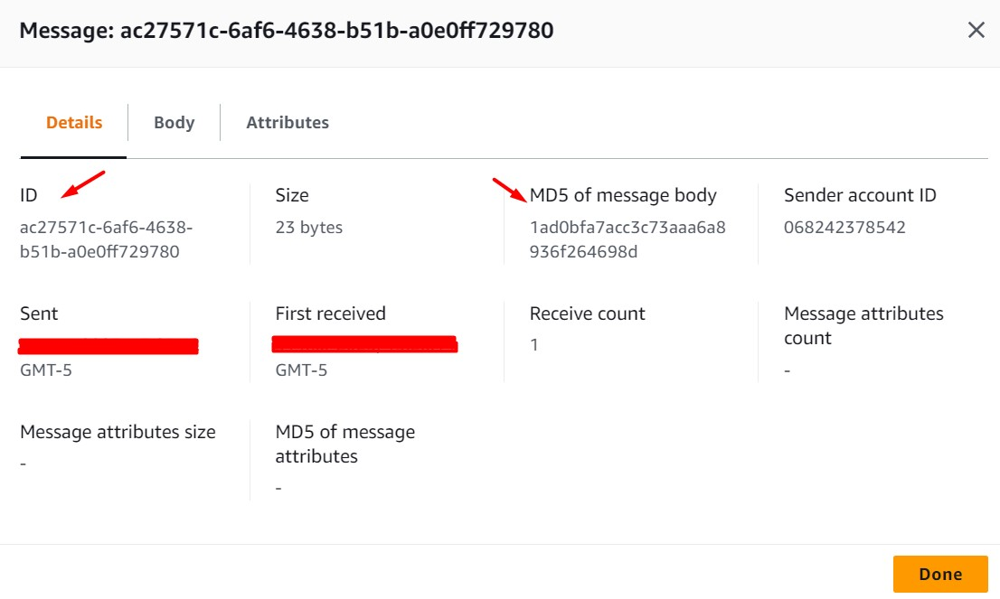
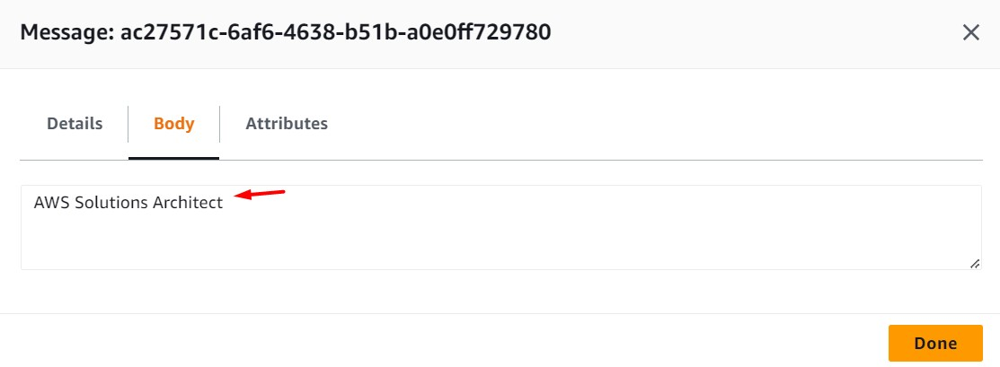
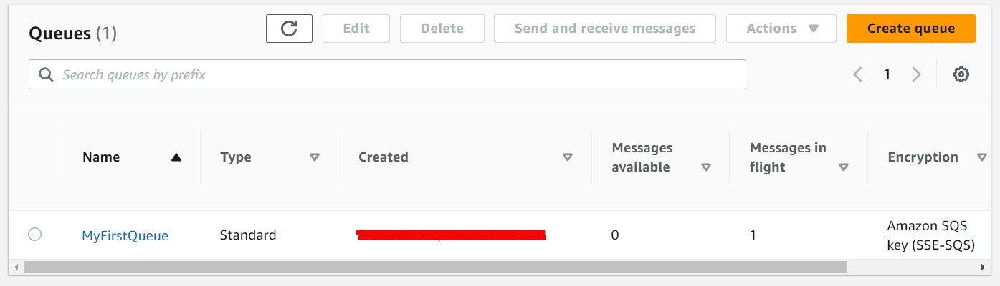
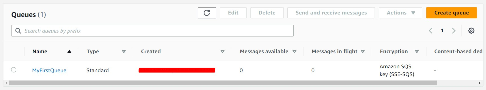

# AWS Solutions Architect Associate - Laboratorio 40

<br>

### Objetivo: 
*  Configuración y gestión a través de los métodos create, send, receive, y delete de una cola SQS usando el SDK de NodeJS 

### Tópico:
* Application Integration

### Dependencias:
* Ninguno

<br>

### Referencia:
 * https://github.com/Einsteinish/aws-sqs-node-js-example

---

### A - Configuración y gestión a través de los métodos create, send, receive, y delete de una cola SQS usando el SDK de NodeJS 

<br>


1. Acceder al servicio AWS Cloud9 y generar un nuevo (o encender nuestro) ambiente de trabajo (Ubuntu 18.04 LTS)

<br>

2. Ejecutar los siguinentes comandos en nuestro Cloud9

```bash
#Ubuntu 18.04
sudo apt-get update
git clone https://github.com/jbarreto7991/aws-solutionsarchitectassociate.git
```

<br>

3. Acceder al laboratorio 40 (Lab-40), carpeta "code". Validar que se cuenta con la plantilla de cloudformation "1_lab40-sqs".

<br>

4. Desplegar la respectiva plantilla CloudFormation ejecutando AWSCLI.

<br>

5. **1_lab40-sqs** Esta plantilla contiene los siguientes parámetros de despliegue: KeyPair, SubnetID y VPCID. Reemplazar estos valores en la siguiente línea de comando. Será válido usar la consola de AWS para el despliegue de esta plantilla. Esta plantilla aprovisionará una instancia EC2 que contará con un proyecto de SQS.

<br>

```bash
aws cloudformation create-stack --stack-name lab40-sqs --template-body file://~/environment/aws-solutionsarchitectassociate/Lab-40/code/1_lab40-sqs.yaml --parameters ParameterKey=KeyPair,ParameterValue="aws-solutionsarchitectassociate" ParameterKey=Subnet,ParameterValue="subnet-43d4a125" ParameterKey=Vpc,ParameterValue="vpc-dd59d8a0" --capabilities CAPABILITY_NAMED_IAM
```

<br>

6. Ingresar a la instancia EC2 vía "System Manager - Session Manager" y modificar el archivo config.json según se detalla a continuación:

<br>

```bash
cd /home/ubuntu/aws-sqs-node-js-example/
nano config.json

#Antes
{
    "accessKeyId": "AAAAQ7Y4QB4XMYFMAAAA",
    "secretAccessKey": "AAAAB8mHrdoZhRKH70QjeJPYHCNu+a5YfdfdAAAA",
    "region": "us-east-1"
}

#Después
{
    "region": "us-east-1"
}
```

<br>

7. Desde la instancia EC2, levantar el servicio de la aplicación. Acceder al mismo desde la IP Pública de la instancia EC2.

```bash
#Comando
cd /home/ubuntu/aws-sqs-node-js-example/
node app.js &

#Respuesta del Comando
AWS SQS example app listening at http://:::80
```

<br>



<br>



<br>


8. Desde la instancia EC2, analizar la sección "/create" del archivo "/aws-sqs-node-js-example/app.js". Desde el navegador, acceder a "http://${PUBLIC_IP}/create"

```bash
#Resultado
{"ResponseMetadata":{"RequestId":"e22f6e7a-49d0-5b45-b32f-35e4af078995"},"QueueUrl":"https://sqs.us-east-1.amazonaws.com/068242378542/MyFirstQueue"}
```

<br>



<br>



<br>


9. Accedemos al servicio SQS y validamos la existencia de la cola creada en el paso anterior. Obtenemos el valor del campo "URL" en la sección "Details". Podemos obtener el mismo valor (URL) ejecutando el siguiente comando de AWSCLI en la instancia EC2.

```bash
#Obteniendo la URL usando AWSCLI
REGION=$(curl -s http://169.254.169.254/latest/meta-data/placement/availability-zone | sed 's/\(.*\)[a-z]/\1/')
aws sqs list-queues --region $REGION | jq -r '.QueueUrls[]'
```

<br>



<br>



<br>


10. Desde la instancia EC2, modificar el archivo "/aws-sqs-node-js-example/app.js". Agregar el valor de la "URL" (obtenida en el paso anterior) en el campo "queueUrl" Reiniciar el servicio.

<br>

```bash

#Reemplazo de queueUrl
// Require objects.
var express  = require('express');
var app      = express();
var aws      = require('aws-sdk');
var queueUrl = "https://sqs.us-east-1.amazonaws.com/XXXXXXXXXXXX/MyFirstQueue";
var receipt  = "";

#Reinicio del servicio
sudo lsof -t -i:80 
kill -9 $PID
node app.js &
```

<br>



<br>

11. Desde la instancia EC2, analizar la sección "/send" del archivo "/aws-sqs-node-js-example/app.js". Desde el navegador acceder a "http://${PUBLIC_IP}/send". Analizar el servicio SQS.

```bash
#Resultado
{"ResponseMetadata":{"RequestId":"7d8d433d-8310-5491-9153-18a36f259de4"},"MD5OfMessageBody":"86fb269d190d2c85f6e0468ceca42a20","MessageId":"865a8399-09bc-4869-a100-26ca2dcf821a"}
```
<br>


<br>



<br>



<br>

12. Desde la instancia EC2, analizar la sección "/receive" del archivo "/aws-sqs-node-js-example/app.js". Guardar el valor del campo "ReceiptHandle" (será usado en el siguiente paso). Desde el navegador acceder a "http://${PUBLIC_IP}/receive". Analizar el servicio SQS.

<br>


<br>


<br>


<br>

```bash
#Resultado del comando "receive"
{"ResponseMetadata":{"RequestId":"db88864d-791b-53ea-a847-ddd394286fd4"},"Messages":[{"MessageId":"865a8399-09bc-4869-a100-26ca2dcf821a","ReceiptHandle":"AQEBKb6BN5Dw3burpK2/yL/C9MrdcLoaaNNwnDJEu238pNlpNvYC/xCFkzvRcD8y3jk40Bg9DEHD4EeA5knEg/6fNYAbpa58e1R6HZSgOL7Ao4gKbGDzDITtAwBW0qWlIJG36fdqd5SBs2iSydHYAAUgZ4oh3bnkE2qwS9QKOpngBAubTbV1evsmthNMuCmq0FlUALr5kHGIfKq1WudpHXY6xH4IQsHAJmGxvUay6nfxx3dIU1GqztgRliEnOvNysLlk8qo7NwlT0TbVCCuTk1oISKKrY41ukOe0iqgpJQxflf/2OO/wJ5VYakLrqNOo/qdHPCzCwkAKnreMqtNcY5xNM+McFOb5YwtcitoM6Ix2XDgHjmhZrS1U2KqZPXBXV0lJxpoGTVV+4CfTlghnuPxg5Q==","MD5OfBody":"86fb269d190d2c85f6e0468ceca42a20","Body":"Hello world!"}]}
```

<br>

13. Desde la instancia EC2, analizar la sección "/delete" del archivo "/aws-sqs-node-js-example/app.js". Agregar el valor obtenido (ReceiptHandle) en el paso anterior en la sección "receipt" de este archivo. Reiniciar el servicio. Desde el navegador acceder a "http://${PUBLIC_IP}/receive". Analizar el servicio SQS.

```bash
#Reemplazo de la variable receipt
// Require objects.
var express  = require('express');
var app      = express();
var aws      = require('aws-sdk');
var queueUrl = "https://sqs.us-east-1.amazonaws.com/XXXXXXXXXXXX/MyFirstQueue";
var receipt  = "AQEBKb6BN5Dw3burpK2/yL/C9MrdcLoaaNNwnDJEu238pNlpNvYC/xCFkzvRcD8y3jk40Bg9DEHD4EeA5knEg/6fNYAbpa58e1R6HZSgOL7Ao4gKbGDzDITtAwBW0qWlIJG36fdqd5SBs2iSydHYAAUgZ4oh3bnkE2qwS9QKOpngBAubTbV1evsmthNMuCmq0FlUALr5kHGIfKq1WudpHXY6xH4IQsHAJmGxvUay6nfxx3dIU1GqztgRliEnOvNysLlk8qo7NwlT0TbVCCuTk1oISKKrY41ukOe0iqgpJQxflf/2OO/wJ5VYakLrqNOo/qdHPCzCwkAKnreMqtNcY5xNM+McFOb5YwtcitoM6Ix2XDgHjmhZrS1U2KqZPXBXV0lJxpoGTVV+4CfTlghnuPxg5Q==";

#Resultado del Comando "delete" ejecutado
{"ResponseMetadata":{"RequestId":"bbc6c3d3-88a1-551e-9c67-984d74cbaa45"}}

#Reinicio del servicio
sudo lsof -t -i:80 
kill -9 $PID
node app.js &
```
<br>


<br>


<br>


<br>


<br>


14. Desde la instancia EC2, analizar la sección "/purge" del archivo "/aws-sqs-node-js-example/app.js". Desde el navegador acceder a "http://${PUBLIC_IP}/purge". Analizar el servicio SQS.

<br>


<br>


<br>


