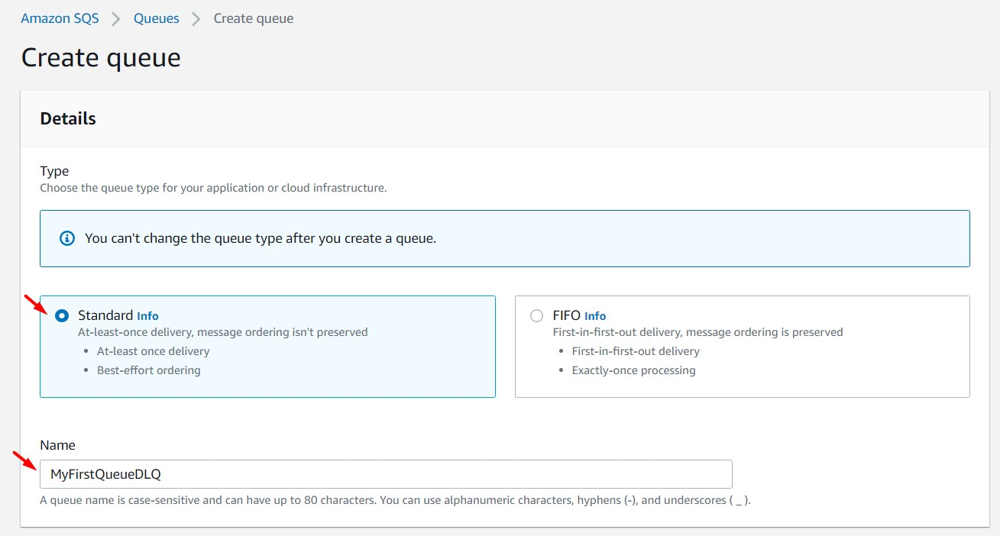
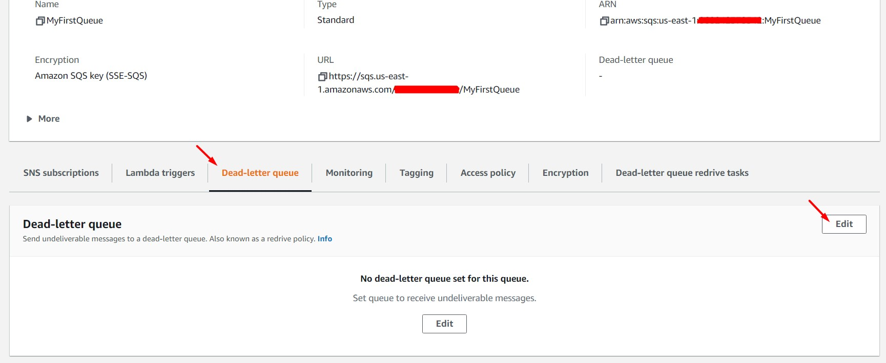
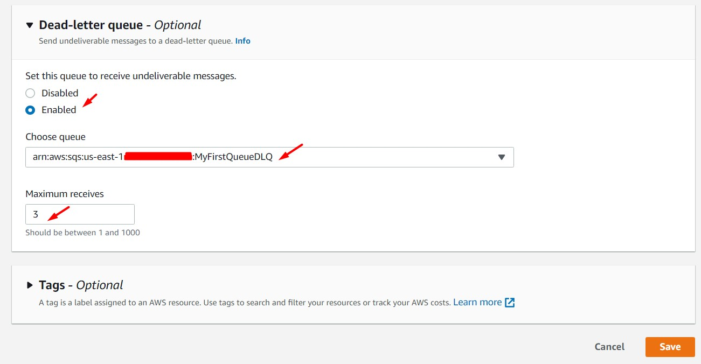
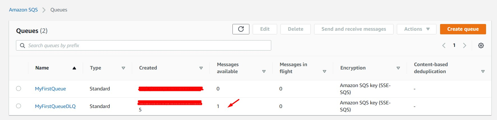
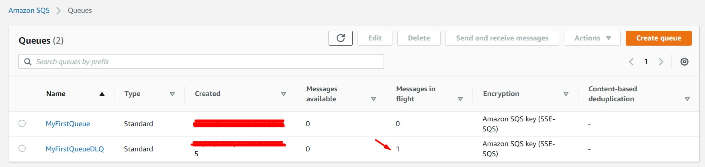

# AWS Solutions Architect Associate - Laboratorio 42

<br>

### Objetivo: 
*  Configuración de la propiedad "Dead Letter Queue" en una cola SQS 

### Tópico:
* Application Integration

### Dependencias:
* Implementación del Laboratorio 40

<br>


---

### A - Configuración de la propiedad "Dead Letter Queue" en una cola SQS 

<br>


1. Después de ejecutar el laboratorio Lab-40, procedemos a identificar la URL de la cola SQS aprovisionada. Ejecutamos el siguiente comando en la instancia EC2. Nos conectamos a ella a través de "System Manager - Session Manager".

```bash
#Comando
REGION=$(curl -s http://169.254.169.254/latest/meta-data/placement/availability-zone | sed 's/\(.*\)[a-z]/\1/')
aws sqs list-queues --region $REGION | jq -r '.QueueUrls[]'
QUEUE_URL=$(aws sqs list-queues --region $REGION | jq -r '.QueueUrls[]')
echo $QUEUE_URL

#Resultado
https://queue.amazonaws.com/XXXXXXXXXXXX/MyFirstQueue
```

<br>

2. Desde la consola de SQS, crear una cola SQS DLQ. Ejecutar los siguientes pasos:
 - Dar clic en "Create SQS"
 - Type: Standard
 - Name: MyFirstQueueDLQ
 - Configuration: Por defecto
 - Access Policy: Por defecto
 - Dead-letter queue: Por defecto
 - Dar clic en "Create SQS"




<br>

3. Desde la consola de SQS, acceder a la cola SQS "MyFirstQueue". Ir a la sección "Dead-letter queue" y dar clic en Edit. Configurar los siguientes valores:
 - Set this queue to receive undeliverable messages: Enabled
 - Choose queue: MyFirstQueueDLQ 
 - Maximum receives: 3

<br>



<br>



<br>

4. Desde la instancia EC2 generada a través del template de CloudFormation setear las siguientes variables:

```bash
REGION=$(curl -s http://169.254.169.254/latest/meta-data/placement/availability-zone | sed 's/\(.*\)[a-z]/\1/')
aws sqs list-queues --region $REGION | jq -r '.QueueUrls[]'
QUEUE_URL=$(aws sqs list-queues --region $REGION | jq -r '.QueueUrls[]' | awk 'NR==1{print $1}')
echo $QUEUE_URL
```

<br>

5. (Paso opcional). Validar que la cola SQS "MyFirstQueue" aún contiene 1 mensaje disponible, de no ser así generar 1 mensaje con el siguiente comando:

```bash
#Comando
aws sqs send-message --queue-url $QUEUE_URL --message-body "Message 1" --region $REGION

#Resultado
{
    "MD5OfMessageBody": "68390233272823b7adf13a1db79b2cd7",
    "MessageId": "d9cf5b4c-069a-4d79-9cba-a27f7bb760ef"
}
```

<br>

6. (Paso opcional). Validar que la cola SQS "MyFirstQueue" tenga configurado como parámetros el valor de "0" en el campo "Receive message wait time", de no ser así usar los siguientes comandos.

```bash
#Comando
aws sqs get-queue-attributes --queue-url $QUEUE_URL --region $REGION --attribute-names All
aws sqs set-queue-attributes --queue-url $QUEUE_URL --region $REGION --attributes '{"ReceiveMessageWaitTimeSeconds": "0"}'

#Resultado
{
    "Attributes": {
        "QueueArn": "arn:aws:sqs:us-east-1:XXXXXXXXXXXX:MyFirstQueue",
        "ApproximateNumberOfMessages": "1",
        "ApproximateNumberOfMessagesNotVisible": "0",
        "ApproximateNumberOfMessagesDelayed": "0",
        "CreatedTimestamp": "1663381011",
        "LastModifiedTimestamp": "1667098545",
        "VisibilityTimeout": "10",
        "MaximumMessageSize": "262144",
        "MessageRetentionPeriod": "345600",
        "DelaySeconds": "0",
        "RedrivePolicy": "{\"deadLetterTargetArn\":\"arn:aws:sqs:us-east-1:XXXXXXXXXXXX:MyFirstQueueDLQ\",\"maxReceiveCount\":3}",
        "ReceiveMessageWaitTimeSeconds": "0",
        "SqsManagedSseEnabled": "true"
    }
}
```

<br>

7. (Paso opcional). Validar que la cola SQS "MyFirstQueue" tenga configurado como parámetros el valor de "10" en el campo "Default visibility timeout", de no ser así usar los siguientes comandos.

```bash
#Comando
aws sqs get-queue-attributes --queue-url $QUEUE_URL --region $REGION --attribute-names All
aws sqs set-queue-attributes --queue-url $QUEUE_URL --attributes '{"VisibilityTimeout": "10"}' --region $REGION

#Resultado
{
    "Attributes": {
        "QueueArn": "arn:aws:sqs:us-east-1:XXXXXXXXXXXX:MyFirstQueue",
        "ApproximateNumberOfMessages": "1",
        "ApproximateNumberOfMessagesNotVisible": "0",
        "ApproximateNumberOfMessagesDelayed": "0",
        "CreatedTimestamp": "1663381011",
        "LastModifiedTimestamp": "1667098545",
        "VisibilityTimeout": "10",
        "MaximumMessageSize": "262144",
        "MessageRetentionPeriod": "345600",
        "DelaySeconds": "0",
        "RedrivePolicy": "{\"deadLetterTargetArn\":\"arn:aws:sqs:us-east-1:XXXXXXXXXXXX:MyFirstQueueDLQ\",\"maxReceiveCount\":3}",
        "ReceiveMessageWaitTimeSeconds": "0",
        "SqsManagedSseEnabled": "true"
    }
}
```

<br>

8. Consumir la cola SQS "MyFirstQueue" 3 veces a través de los siguientes comandos. Esperar 15 segundos entre la ejecución de cada comando. Se validará a través de la consola SQS que la cola "MyFirstQueueDLQ" presenta con

```bash
#Comando
aws sqs receive-message --queue-url $QUEUE_URL --region $REGION
sleep 15
aws sqs receive-message --queue-url $QUEUE_URL --region $REGION
sleep 15
aws sqs receive-message --queue-url $QUEUE_URL --region $REGION
sleep 15
aws sqs receive-message --queue-url $QUEUE_URL --region $REGION
aws sqs receive-message --queue-url $QUEUE_URL --region $REGION
aws sqs receive-message --queue-url $QUEUE_URL --region $REGION
```

<br>



<br>


9. Consumir la cola SQS "MyFirstQueueDLQ"

```bash
REGION=$(curl -s http://169.254.169.254/latest/meta-data/placement/availability-zone | sed 's/\(.*\)[a-z]/\1/')
aws sqs list-queues --region $REGION | jq -r '.QueueUrls[]'
QUEUEDLQ_URL=$(aws sqs list-queues --region $REGION | jq -r '.QueueUrls[]' | awk 'NR==2{print $1}')
echo $QUEUEDLQ_URL

aws sqs receive-message --queue-url $QUEUEDLQ_URL --region $REGION
```

<br>



<br>

