# AWS Solutions Architect Associate - Laboratorio 46

<br>

### Objetivo: 
* Integración entre Cognito User Pool & CloudFront

### Tópico:
* Content Delivery
* Security, Identity & Compliance

### Dependencias:
* Ninguna

<br>

---

### A - Despliegue de paso a paso de una distribución ClodFront usando como origen un balanceador de aplicaciones

<br>

1. Debemos tener una llave Key Pair disponible. De no ser así, acceder al servicio EC2 y luego a la opción "Key Pair". Generar llave RSA y .pem 

2. Acceder al servicio AWS Cloud9 y generar un nuevo ambiente de trabajo (Ubuntu 18.04 LTS)

3. Ejecutar los siguinentes comandos en nuestro Cloud9

```bash
#Ubuntu 18.04
sudo apt-get update
git clone https://github.com/jbarreto7991/aws-solutionsarchitectassociate.git
```

4. Acceder al laboratorio 46 (Lab-46), carpeta "code". Validar que se cuenta con dos archivos CloudFormation: "1_lab46-vpc.yaml" y "2_lab46-ec2-s3-cloudfront.yaml". Analizar el contenido de estos archivos.

5. Desplegar cada plantilla CloudFormation ejecutando AWSCLI. Considerar los parámetros a ser ingresados.

    <br>
6. **1_lab46-vpc.yaml** (Esperar el despliegue total de esta plantilla cloudformation para continuar con la siguiente plantillas). En la sección "ParameterValue", ingresar el nombre del KeyPair creado en el paso 1. Esta plantilla creará la VPC "192.168.0.0/16", 06 Subnets dentro de este CIDR, un NAT Instances y demás componentes de red. No deberán existir redes existentes en este rango de IPs. Validar la creación del Stack desde la consola AWS a través del servicio AWS CloudFormation. El siguiente comando considera el valor "aws-solutionsarchitectassociate" para el KeyPair, reemplazar el nombre según la llave respectiva.

```bash
aws cloudformation create-stack --stack-name lab46-vpc --template-body file://~/environment/aws-solutionsarchitectassociate/Lab-46/code/1_lab46-vpc.yaml --parameters ParameterKey=KeyPair,ParameterValue="aws-solutionsarchitectassociate" --capabilities CAPABILITY_IAM
```

7. **2_lab46-ec2-s3-cloudfront.yaml**. En la sección "Parameters", ingresar el nombre del KeyPair creado en el paso 1. Esta plantilla creará dos instancias EC2 (PROD BACKEND y PROD DB), un balanceador de aplicaciones y un Bucket S3 (con el nombre 'aws-solutionsarchitectassociate-${AWS::AccountId}'). Además, aprovisionará una distribución CloudFront y una configuración segura OAI.

```bash
aws cloudformation create-stack --stack-name lab46-ec2-s3-cloudfront --template-body file://~/environment/aws-solutionsarchitectassociate/Lab-46/code/2_lab46-ec2-s3-cloudfront.yaml --parameters ParameterKey=KeyPair,ParameterValue="aws-solutionsarchitectassociate" --capabilities CAPABILITY_IAM
```

<br>

8. Después de unos minutos accedemos a la URL que genera CloudFront. Cargamos la página en HTTP (no en HTTPS). Por ejemplo: http://dw1c6i4dj4lki.cloudfront.net	/. Validamos la carga de nuestra aplicación.

<br>


<br>

9. Accedemos al servicio "Cognito - Manage User Pools" y damos clic en el botón "Create a user pool". Ingresamos/seleccionamos los siguientes valores:
  - Pool name: lab46-user-pool
  - How do you want to create your user pool?: Step through settings
  - Attributes: Valores por defecto. Clic en "Next Steps"
  - Policies: Valores por defecto. Clic en "Next Steps"
  - MFA and verifications: Valores por defecto. Clic en "Next Steps"
  - Message customizations: Valores por defecto. Clic en "Next Steps"
  - Tags: Valores por defecto. Clic en "Next Steps"
  - Device: Valores por defecto. Clic en "Next Steps"
  - App clients: Valores por defecto.
  - Triggers: Valores por defecto.
  - Review: Clic en "Create pool"


<br>


<br>

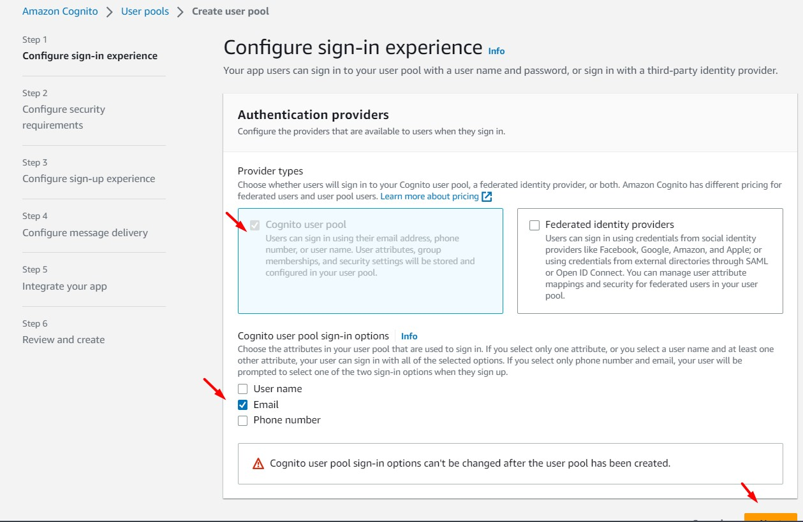

<br>


<br>

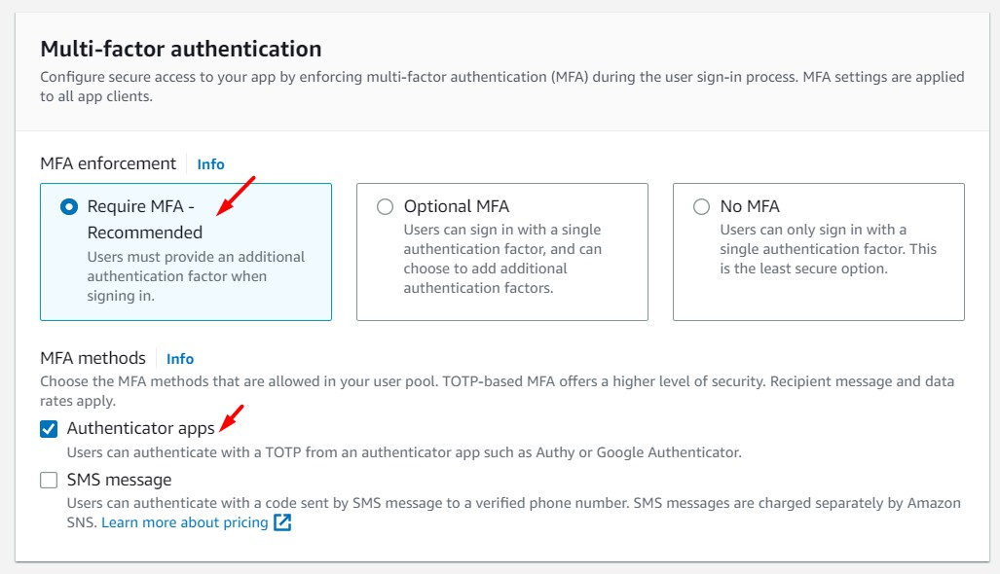

<br>

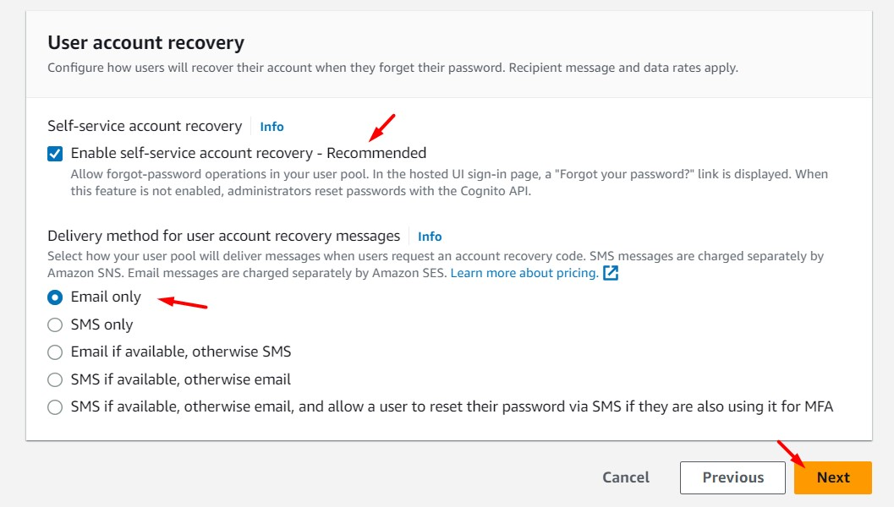

<br>

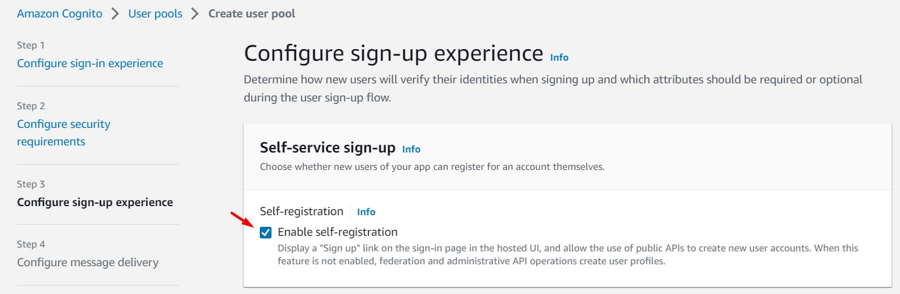

<br>

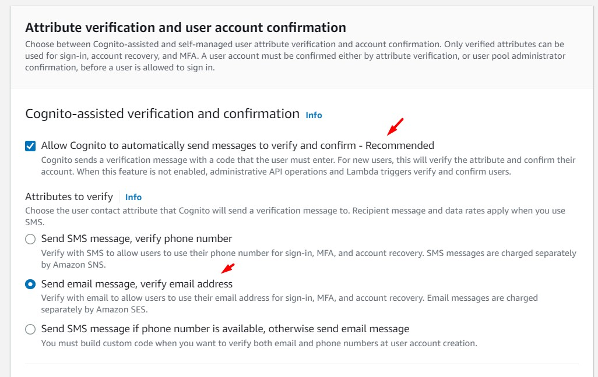

<br>


<br>

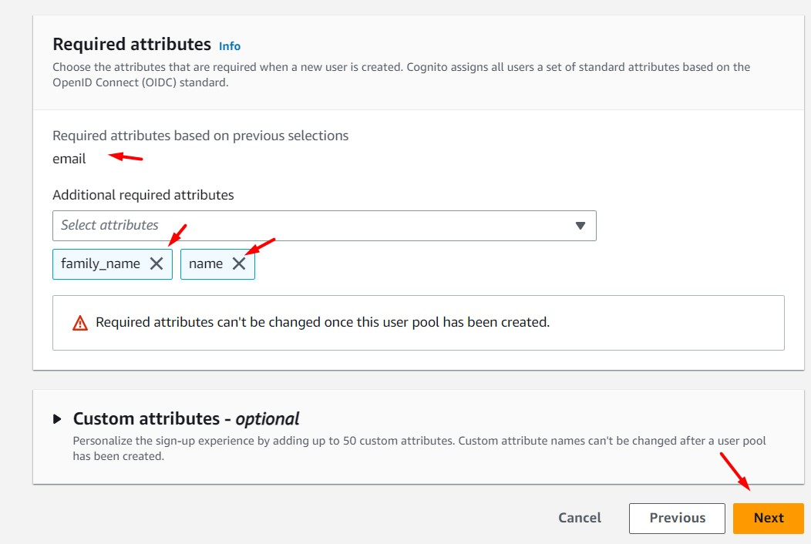

<br>

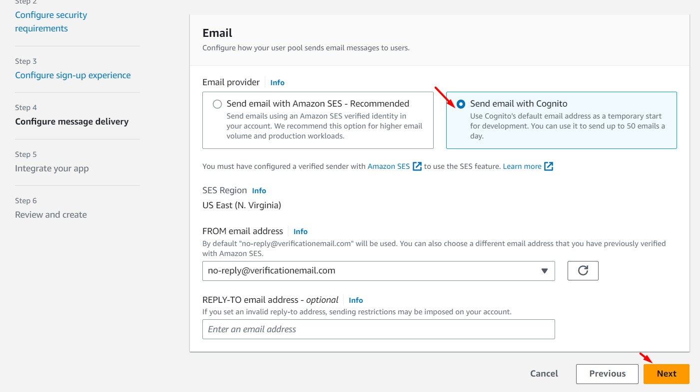

<br>

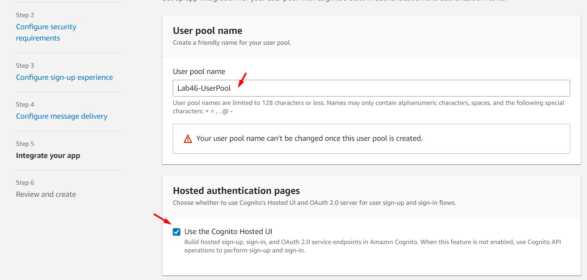

<br>


<br>


<br>


<br>

10. Desde Cognito, accedemos a la opción "App Integration - Domain Name" y agregamos un "Amazon Cognito Domain". Ingresamos un valor en el campo "Domain prefix" y luego damos clic en el botón "Check". Si el dominio está disponible, salvamos los cambios

<br>


<br>

11. Desde Cognito, accedemos a la opción "General Settings - App Clients" y damos clic en la opción "Add an app client". Ingresamos los siguientes valores. Luego, damos clic en el botón "Create app client"
 - App client name: cloudfront-appclient


<br>


<br>

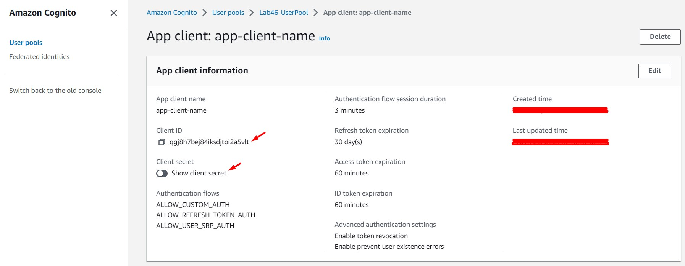

<br>

12. Desde Cognito, accedemos a la opción "App Integration - App Client Settings". Ingresamos los siguientes valores. Luego, damos clic en el botón "Save changes"
 - Enabled Identity Providers: Select all
 - Cognito User Pool: Enable
 - Sign in and sign out URLs:
    * Callback URL(s): https://<URL_CLOUDFRONT>
    * Sign out URL(s): https://<URL_CLOUDFRONT>
 - OAuth 2.0
    * Allowed OAuth Flows: Implicit grant
    * Allowed OAuth Scopes: openid

<br>


<br>


<br>

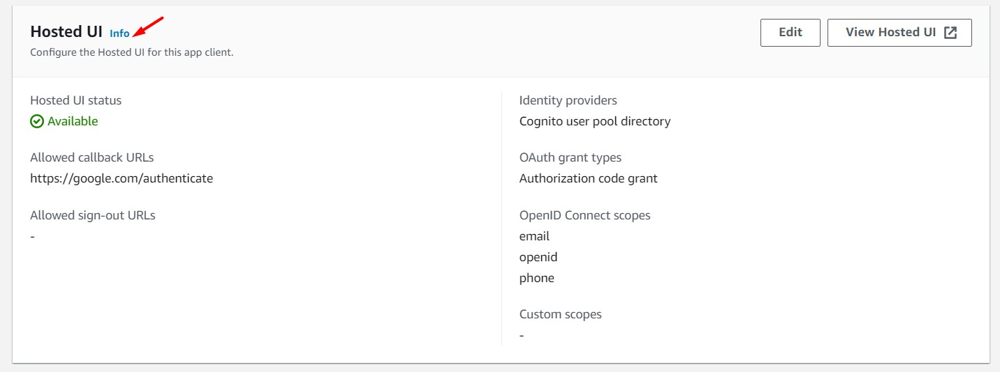

<br>

13. Desde Cognito, accedemos a la opción "General Settings - Users and groups" y damos clic sobre el botón "Create User". Ingresamos los siguientes valores. Al finalizar dar clic en "Create User"
 - Username (Required): user01
 - Temporary password: Debe contener mayúscula, minúscula, número y caracter especial

<br>

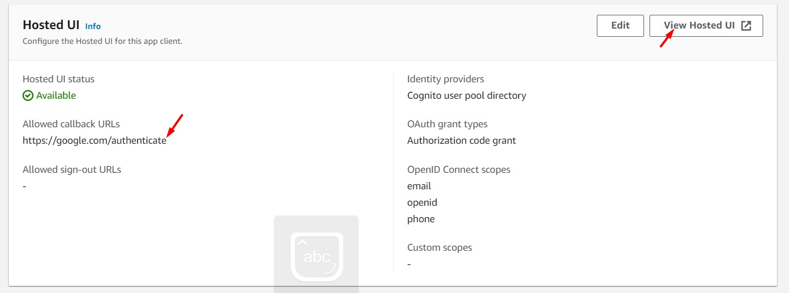

<br>


<br>

14. Desde Cognito, accedemos a la opción "App integration - App client settings". Nos dirigimos a la opción "Hosted UI" y damos clic sobre la opción "Launch Hosted UI". Ingresamos el usuario y contraseña creado en el paso anterior en la nueva ventana. Luego, se nos solicitará el cambio de contraseña. Terminado estos pasos validaremos el acceso a nuestra aplicación.  

<br>


<br>

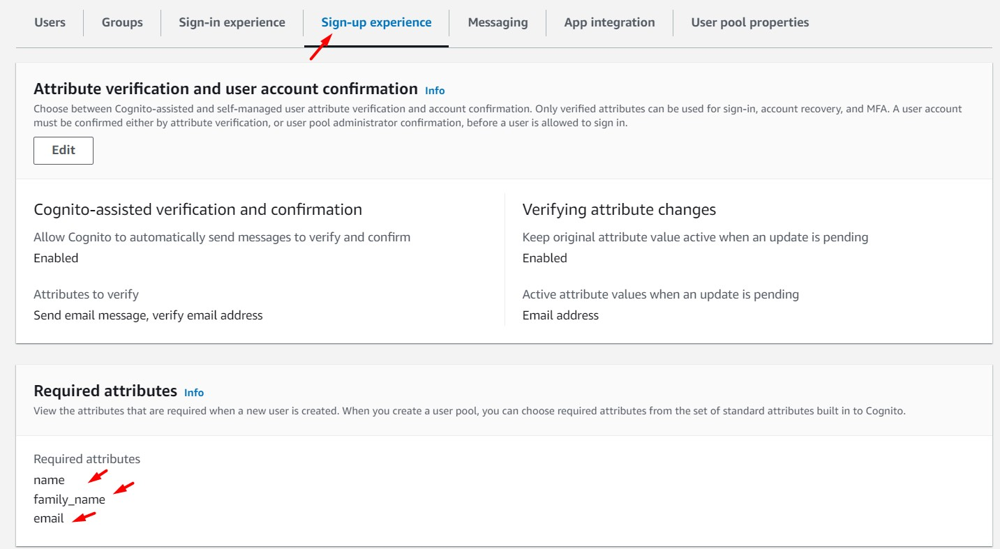

<br>


<br>


### Eliminación de recursos

```bash
Cognito User Pool
Contenido de bucket S3
aws cloudformation delete-stack --stack-name lab46-ec2-s3-cloudfront
aws cloudformation delete-stack --stack-name lab46-vpc
```
