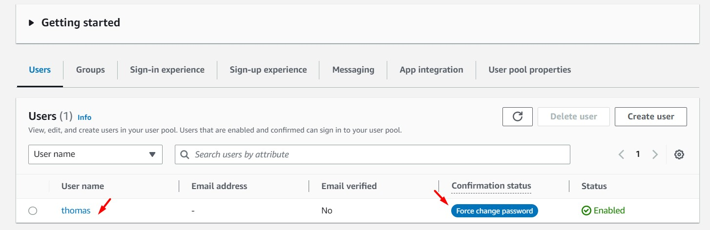

# AWS Solutions Architect Associate - Laboratorio 47

<br>

### Objetivo: 
* Obtención de credenciales temporales STS consumiendo el servicio de Cognito Identity Pool usando AWSCLI

### Tópico:
* Security, Identity & Compliance

### Dependencias:
* Ninguna

<br>

---

### A - Obtención de credenciales temporales STS consumiendo el servicio de Cognito Identity Pool usando AWSCLI

<br>

1. Debemos tener una llave Key Pair disponible. De no ser así, acceder al servicio EC2 y luego a la opción "Key Pair". Generar llave RSA y .pem 

2. Acceder al servicio AWS Cloud9 y generar un nuevo ambiente de trabajo (Ubuntu 18.04 LTS)

3. Ejecutar los siguinentes comandos en nuestro Cloud9

```bash
#Ubuntu 18.04
sudo apt-get update
git clone https://github.com/jbarreto7991/aws-solutionsarchitectassociate.git
```

4. Acceder al laboratorio 47 (Lab-47), carpeta "code". Validar que se cuenta con el archivo "1_lab47-cognito-identitypool.yaml". Analizar el contenido de este archivo

5. Desplegar la plantilla CloudFormation ejecutando AWSCLI. Considerar los parámetros a ser ingresados.

    <br>
6. **1_lab47-cognito-identitypool.yaml** (

```bash
aws cloudformation create-stack --stack-name lab47-cognito-identitypool --template-body file://~/environment/aws-solutionsarchitectassociate/Lab-47/code/1_lab47-cognito-identitypool.yaml
```

<br>

7. Desde Cloud9, ejecutamos los siguientes comandos. 

<br>



<br>


### Eliminación de recursos

```bash
aws cloudformation delete-stack --stack-name lab47-cognito-identitypool
```
