# AWS Solutions Architect Associate - Laboratorio 48

<br>

### Objetivo: 
* Integración de Cognito Identity Pool y ALB (Application Load Balancer) a través de ALB Tokens

### Tópico:
* Compute
* Security, Identity & Compliance

### Dependencias:
* Ninguna

<br>

---

### A - Integración de Cognito Identity Pool y ALB (Application Load Balancer) a través de ALB Tokens


<br>

1. Debemos tener una llave Key Pair disponible. De no ser así, acceder al servicio EC2 y luego a la opción "Key Pair". Generar llave RSA y .pem 

2. Acceder al servicio AWS Cloud9 y generar un nuevo ambiente de trabajo (Ubuntu 18.04 LTS)

3. Ejecutar los siguinentes comandos en nuestro Cloud9

```bash
#Ubuntu 18.04
sudo apt-get update
git clone https://github.com/jbarreto7991/aws-solutionsarchitectassociate.git
```

4. Acceder al laboratorio 48 (Lab-48), carpeta "code". Validar que se cuenta con tres archivos CloudFormation: "1_lab48-vpc.yaml", "2_lab48-ec2.yaml" y "3_lab48_alb_targetgroup". Analizar el contenido de estos archivos.

5. Desplegar cada plantilla CloudFormation ejecutando AWSCLI. Considerar los parámetros a ser ingresados.

    <br>
6. **1_lab48-vpc.yaml** (Esperar el despliegue total de esta plantilla cloudformation para continuar con las siguientes plantillas). En la sección "ParameterValue", ingresar el nombre del KeyPair creado en el paso 1. Esta plantilla creará la VPC "192.168.0.0/16", 06 Subnets dentro de este CIDR, un NAT Instances y demás componentes de red. No deberán existir redes existentes en este rango de IPs. Validar la creación del Stack desde la consola AWS a través del servicio AWS CloudFormation. El siguiente comando considera el valor "aws-solutionsarchitectassociate" para el KeyPair, reemplazar el nombre según la llave respectiva.

```bash
aws cloudformation create-stack --stack-name lab48-vpc --template-body file://~/environment/aws-solutionsarchitectassociate/Lab-48/code/1_lab48-vpc.yaml --parameters ParameterKey=KeyPair,ParameterValue="aws-solutionsarchitectassociate" --capabilities CAPABILITY_IAM
```

7. **2_lab48-ec2.yaml** (Esperar el despliegue total de esta plantilla cloudformation para continuar con la siguiente plantilla). En la sección "Parameters", ingresar el nombre del KeyPair creado en el paso 1. Esta plantilla creará dos instancias EC2 ubicados, uno de ellos, en la subnet privada AZ A y el otro en la subnet privada AZ B. 

```bash
aws cloudformation create-stack --stack-name lab48-ec2 --template-body file://~/environment/aws-solutionsarchitectassociate/Lab-48/code/2_lab48-ec2.yaml --parameters ParameterKey=KeyPair,ParameterValue="aws-solutionsarchitectassociate" --capabilities CAPABILITY_IAM
```

8. En el despliegue de recursos a través de CloudFormation se han generado 6 subnets: 2 subnets públicas (a ser usadas por el BALANCEADOR), 2 subnets privadas (donde han sido desplegadas dos EC2 INSTANCES BACKEND) y otras 2 subnets privadas que actualmente no tiene uso, pero serán destinadas en los siguientes laboratorios para la base de datos.


9. **3_lab48-alb-targetgroup.yaml**. Esta plantilla no tiene parámetros por ingresar. Generará un target group y un balanceador de aplicaciones. Además, las instancias EC2 se asociarán al target group en el puerto 80.

```bash
    aws cloudformation create-stack --stack-name lab48-alb-targetgroup --template-body file://~/environment/aws-solutionsarchitectassociate/Lab-48/code/3_lab48-alb-targetgroup.yaml
```

10. **1_lab47-cognito.yaml**. Esta plantilla tiene por objetivo el despliegue de un recurso "Cognito User Pool" y de un recurso "Cognito Identity Pool".

```bash
aws cloudformation create-stack --stack-name lab48-cognito --template-body file://~/environment/aws-solutionsarchitectassociate/Lab-48/code/4_lab48-cognito.yaml --capabilities CAPABILITY_IAM
```

11. Generamos un certificado SSL para nuestro balanceador ALB, desde el servicio "Certificate Manager", a través del método de validación "DNS Validation". Registrar CNAME entregados en Route 53.

12. Desde el servicio Route 53, crear un registro alias hacia el ALB. 

<br>

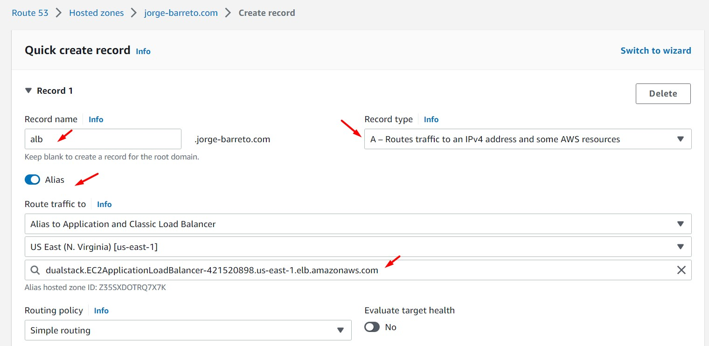

<br>

13. Acceder al servicio de Cognito, y generar un "Domain Name" a través de la opción "App Integration". Dar clic en el botón "Check availability" para validar la disponiblidad del dominio cognito.

<br>


<br>

14. Desde el servicio Cognito, "General settings - App clientes", eliminar la configuración mostrada. Dar clic en la opción "Add an app client". Agregar un nombre en la opción "App client name" y dar clic en "Create app client" (Se realiza este paso para generar un "App client secret", configuración solicitada por el ALB)

<br>

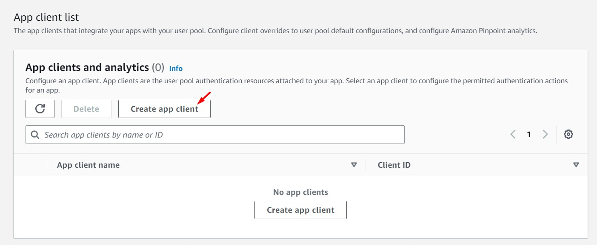

<br>

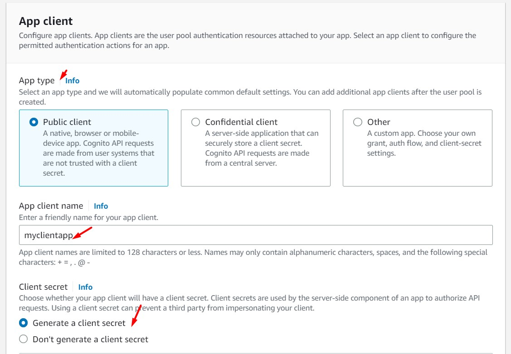

<br>

15. Desde el servicio Cognito, "App Integration - App client settings", realizar la siguiente configuración. Al finalizar esta, dar clic en el botón "Save changes"

    - Enabled Identity Providers: Select all
        - Cognito User Pool: Enable
    - Sign in and sign out URLs
        - Callback URL(s): https://<DOMAIN_ROUTE53_ALB>/oauth2/idpresponse
    - OAuth 2.0
        - Allowed OAuth Flows: Authorization code grant	
        - Allowed OAuth Scopes: 
            - email
            - openid

<br> 

16. Desde el features del ALB, configurar el listener 443
    - Add Listener
    - Protocol: HTTPS
    - Port: 443
    - Default actions: 1. Forward to
        - Target group: Seleccionar Target Group respectivo
    - Secure listener settings
        - Security policy: ELBSecurityPolicy-2016-08
    - Default SSL/TLS certificate
        - From ACM: Seleccionar el certificado generado en el paso 11

<br>

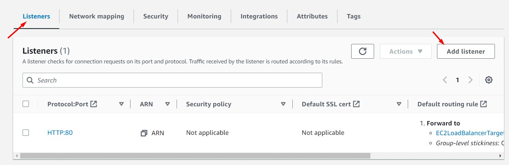

<br>

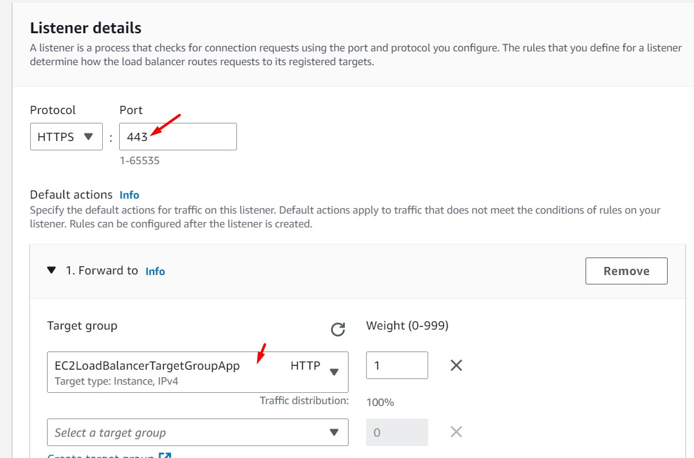

<br>

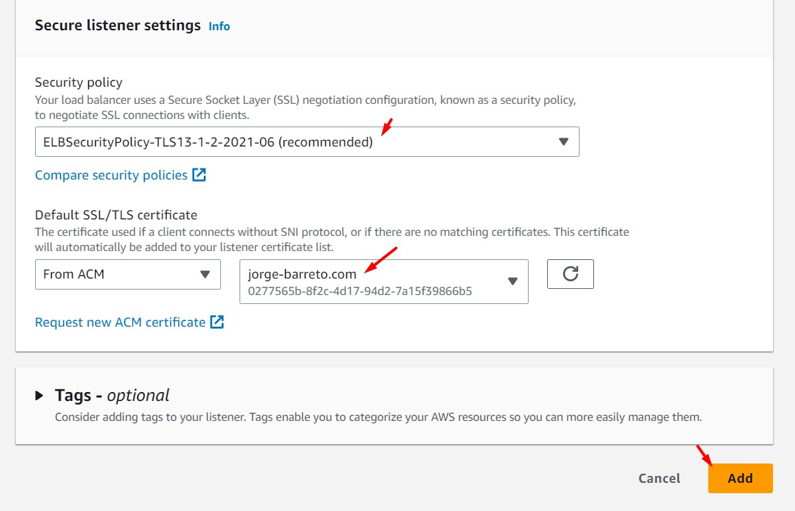

<br>

17. Desde esa misma ventana, dar clic en el botón "Add action". Al finalizar la configuración dar clic en el botón "Add"

    - Default actions: 1. Authenticate
        - Identity provider - optional: Amazon Cognito
        - Cognito user pool: Seleccionar "Cognito User Pool"
        - App client: Seleccionar "App Client"
        - Cognito user pool domain: Se cargará automáticamente
        - Advanced cookie name (Visualizar los siguientes valores por defecto):
            - Session cookie name: AWSELBAuthSessionCookie
            - Session timeout: 604800
            - Scope: openid
            - Action on unauthenticated request: Authenticate (client reattempt)


<br>

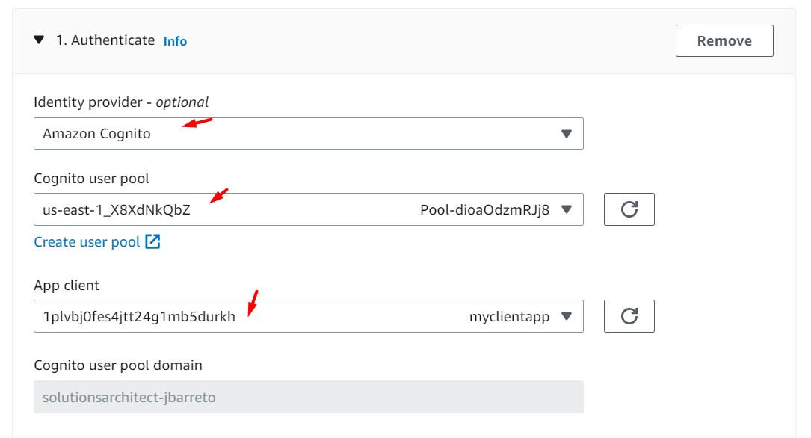

<br>

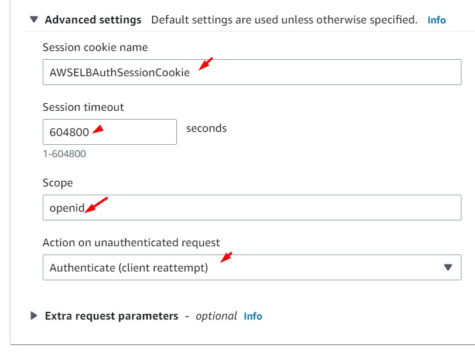

<br>

18. Desde la web, ingresamos al dominio del balanceador generado en el paso 12. Validamos que existe un direccionamiento hacia el login de Cognito.

<br>

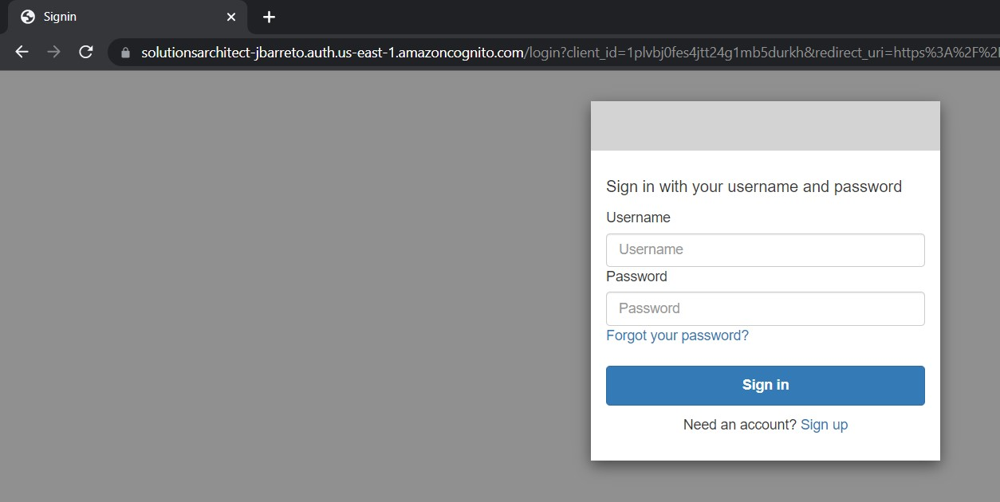

<br>

19. Desde el servicio Cognito, procedemos a crear un usuario. La contraseña del usuario deberá contener una mayúscula, minúscula, número y un caracter especial.

<br>

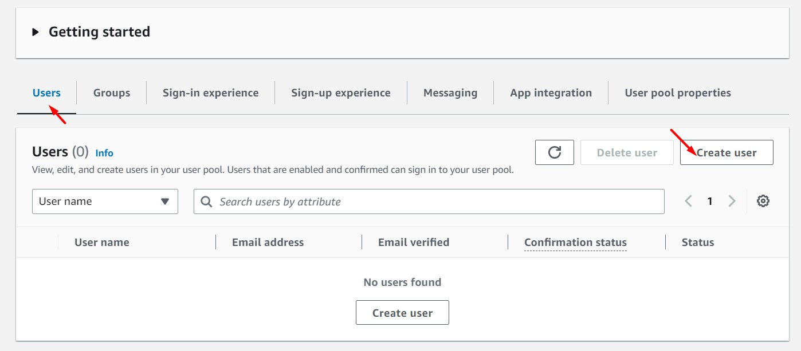

<br>

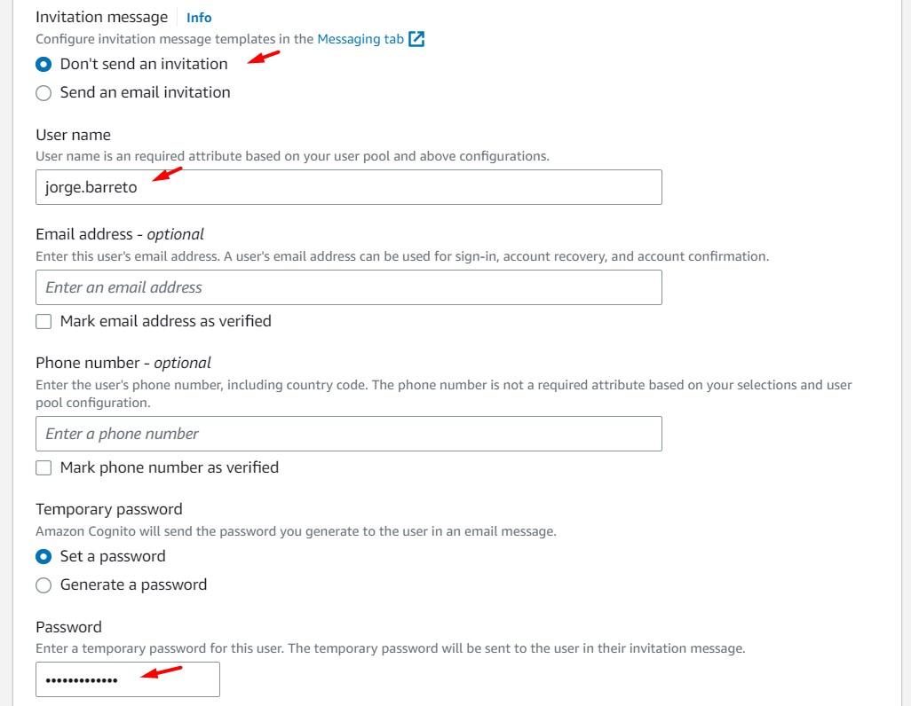

<br>

20. Nos logueamos al login detallado en el paso 18 con el usuario generado en el paso anterior y validamos que se nos solicita cambio de contraseña. Al ingresar la nueva contraseña y dar clic en el botón respectivo, podemos visualizar el contenido de nuestra aplicación servida desde ALB.

<br>

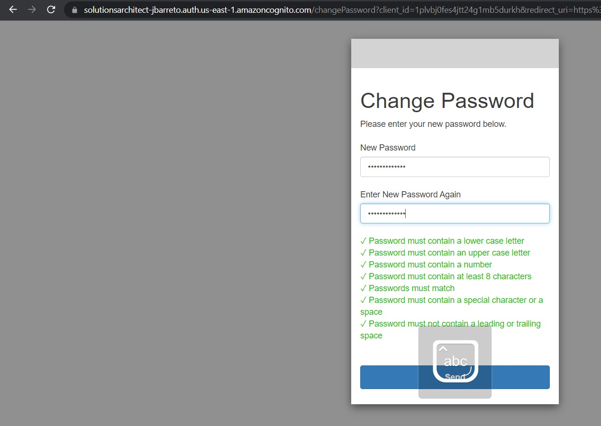

<br>

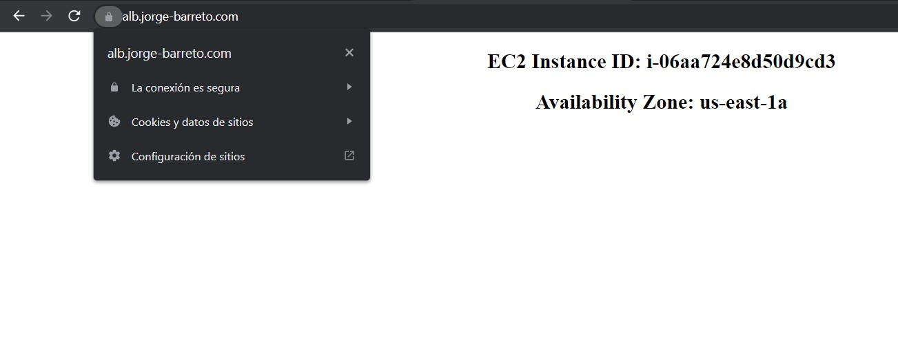

<br>


---

### Eliminación de recursos

```bash
Cognito - Delete Domain Name
aws cloudformation delete-stack --stack-name lab48-cognito
aws cloudformation delete-stack --stack-name lab48-alb-targetgroup
Eliminar Target Group
aws cloudformation delete-stack --stack-name lab48-ec2
aws cloudformation delete-stack --stack-name lab48-vpc
```