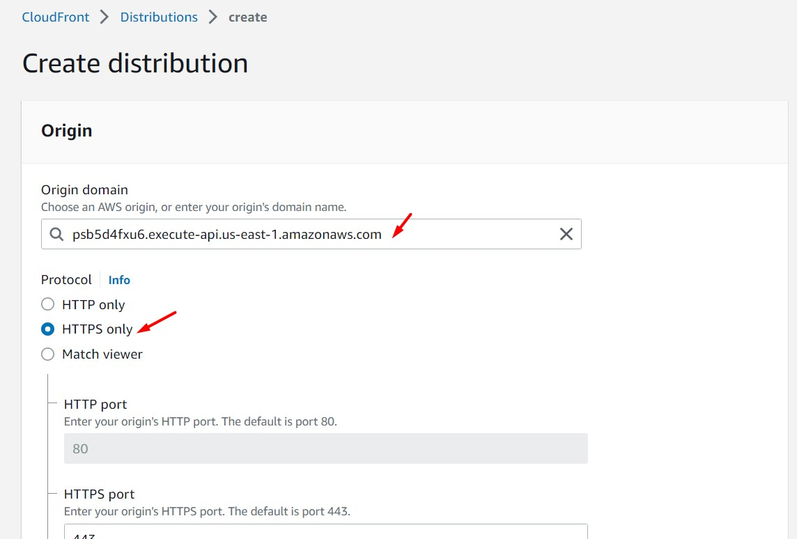

# AWS Solutions Architect Associate - Laboratorio 49

<br>

### Objetivo: 
* Integración entre WAF y API Gateway y configuración de ACLs “manual ip block rule” y “sqli rule”

### Tópico:
* Compute
* Security, Identity & Compliance
* Database
* Application Integration

### Dependencias:
* Ninguna

<br>

---

### A - Integración entre WAF y API Gateway y configuración de ACLs “manual ip block rule” y “sqli rule”


<br>

1. Acceder al servicio AWS Cloud9 y generar un nuevo ambiente de trabajo (Ubuntu 18.04 LTS)

2. Ejecutar los siguinentes comandos en nuestro Cloud9

```bash
#Ubuntu 18.04
sudo apt-get update
git clone https://github.com/jbarreto7991/aws-solutionsarchitectassociate.git
sam --version
```

3. Acceder al laboratorio 49 (Lab-49), carpeta "code". Validar que se cuenta con el archivo "1_lab49-waf.json" y la carpeta "SAM". Analizar el contenido de estos archivos.

4. Desplegar la plantilla CloudFormation **1_lab49-waf.json** ejecutando AWSCLI 

```bash
aws cloudformation create-stack --stack-name lab49-waf --template-body file://~/environment/aws-solutionsarchitectassociate/Lab-49/code/1_lab49-waf.json
```

<br>

5. Desplegar la plantilla "SAM/template.yaml" usando "sam init" de SAM (Serverless Application Model) desde Cloud9

```bash
#Comando
cd /home/ubuntu/environment/aws-solutionsarchitectassociate/Lab-49/code/SAM/
sam init

#Mensaje SAM
Which template source would you like to use?
        1 - AWS Quick Start Templates
        2 - Custom Template Location

#Responder
Choice:2

#Mensaje SAM
Template location (git, mercurial, http(s), zip, path):

#Responder
/home/ubuntu/environment/aws-solutionsarchitectassociate/Lab-49/code/SAM/sam-app.zip

#Mensaje SAM
-----------------------
Generating application:
-----------------------
Location: /home/ubuntu/environment/aws-solutionsarchitectassociate/Lab-49/code/SAM/sam-app.zip
Output Directory: .
    
SAM CLI update available (1.61.0); (1.33.0 installed)
To download: https://docs.aws.amazon.com/serverless-application-model/latest/developerguide/serverless-sam-cli-install.html
```

<br>

6. Desplegar la plantilla "SAM/template.yaml" usando "sam build" de SAM (Serverless Application Model)

```bash
#Comando
sam build

#Mensaje SAM
Building codeuri: /home/ubuntu/environment/aws-solutionsarchitectassociate/Lab-49/code/SAM/dynamo-handler runtime: nodejs12.x metadata: {} architecture: x86_64 functions: ['DDBHandlerFunction']
package.json file not found. Continuing the build without dependencies.
Running NodejsNpmBuilder:CopySource

Build Succeeded

Built Artifacts  : .aws-sam/build
Built Template   : .aws-sam/build/template.yaml

Commands you can use next
=========================
[*] Invoke Function: sam local invoke
[*] Deploy: sam deploy --guided
```

<br>

7. Desplegar la plantilla "SAM/template.yaml" usando "sam deploy --guided" de SAM (Serverless Application Model)

```bash
#Comando
sam deploy --guided

#Comando y Mensaje SAM. Respuesta al final de cada mensaje

Configuring SAM deploy
======================

        Looking for config file [samconfig.toml] :  Found
        Reading default arguments  :  Success

        Setting default arguments for 'sam deploy'
        =========================================
        Stack Name [sam-app]: 
        AWS Region [us-east-1]: 
        #Shows you resources changes to be deployed and require a 'Y' to initiate deploy
        Confirm changes before deploy [Y/n]: Y
        #SAM needs permission to be able to create roles to connect to the resources in your template
        Allow SAM CLI IAM role creation [Y/n]: Y
        DDBHandlerFunction may not have authorization defined, Is this okay? [y/N]: y
        DDBHandlerFunction may not have authorization defined, Is this okay? [y/N]: y
        DDBHandlerFunction may not have authorization defined, Is this okay? [y/N]: y
        DDBHandlerFunction may not have authorization defined, Is this okay? [y/N]: y
        Save arguments to configuration file [Y/n]: Y
        SAM configuration file [samconfig.toml]: 
        SAM configuration environment [default]: 

        Looking for resources needed for deployment:
        Creating the required resources...
        Successfully created!
         Managed S3 bucket: aws-sam-cli-managed-default-samclisourcebucket-1gdcb56rx7r6e
         A different default S3 bucket can be set in samconfig.toml

        Saved arguments to config file
        Running 'sam deploy' for future deployments will use the parameters saved above.
        The above parameters can be changed by modifying samconfig.toml
        Learn more about samconfig.toml syntax at 
        https://docs.aws.amazon.com/serverless-application-model/latest/developerguide/serverless-sam-cli-config.html

Uploading to sam-app/e972c01900de2ca33a1df902d6a5f057  675 / 675  (100.00%)

        Deploying with following values
        ===============================
        Stack name                   : sam-app
        Region                       : us-east-1
        Confirm changeset            : True
        Deployment s3 bucket         : aws-sam-cli-managed-default-samclisourcebucket-1gdcb56rx7r6e
        Capabilities                 : ["CAPABILITY_IAM"]
        Parameter overrides          : {}
        Signing Profiles             : {}

Initiating deployment
=====================
Uploading to sam-app/5c9bb5e9a117b950770c09456205f0f8.template  1524 / 1524  (100.00%)

Waiting for changeset to be created..

CloudFormation stack changeset
-----------------------------------------------------------------------------------------------------------------------------------------------------
Operation                             LogicalResourceId                     ResourceType                          Replacement                         
-----------------------------------------------------------------------------------------------------------------------------------------------------
+ Add                                 DDBHandlerFunctionCreateOrUpdateIte   AWS::Lambda::Permission               N/A                                 
                                      mPermissionProd                                                                                                 
+ Add                                 DDBHandlerFunctionDeleteAnItemPermi   AWS::Lambda::Permission               N/A                                 
                                      ssionProd                                                                                                       
+ Add                                 DDBHandlerFunctionGetAllItemsPermis   AWS::Lambda::Permission               N/A                                 
                                      sionProd                                                                                                        
+ Add                                 DDBHandlerFunctionGetAnItemPermissi   AWS::Lambda::Permission               N/A                                 
                                      onProd                                                                                                          
+ Add                                 DDBHandlerFunctionRole                AWS::IAM::Role                        N/A                                 
+ Add                                 DDBHandlerFunction                    AWS::Lambda::Function                 N/A                                 
+ Add                                 ItemsTable                            AWS::DynamoDB::Table                  N/A                                 
+ Add                                 ServerlessRestApiDeployment5df6f31e   AWS::ApiGateway::Deployment           N/A                                 
                                      3b                                                                                                              
+ Add                                 ServerlessRestApiProdStage            AWS::ApiGateway::Stage                N/A                                 
+ Add                                 ServerlessRestApi                     AWS::ApiGateway::RestApi              N/A                                 
-----------------------------------------------------------------------------------------------------------------------------------------------------

Changeset created successfully. arn:aws:cloudformation:us-east-1:XXXXXXXXXXXX:changeSet/samcli-deploy1667351522/90ccdc22-c839-455b-89cb-3883b3a7567e


Previewing CloudFormation changeset before deployment
======================================================
Deploy this changeset? [y/N]: y

XXXX-XX-XX XX:XX:XX - Waiting for stack create/update to complete

CloudFormation events from changeset
-----------------------------------------------------------------------------------------------------------------------------------------------------
ResourceStatus                        ResourceType                          LogicalResourceId                     ResourceStatusReason                
-----------------------------------------------------------------------------------------------------------------------------------------------------
CREATE_IN_PROGRESS                    AWS::DynamoDB::Table                  ItemsTable                            -                                   
CREATE_IN_PROGRESS                    AWS::DynamoDB::Table                  ItemsTable                            Resource creation Initiated         
CREATE_COMPLETE                       AWS::DynamoDB::Table                  ItemsTable                            -                                   
CREATE_IN_PROGRESS                    AWS::IAM::Role                        DDBHandlerFunctionRole                Resource creation Initiated         
CREATE_IN_PROGRESS                    AWS::IAM::Role                        DDBHandlerFunctionRole                -                                   
CREATE_COMPLETE                       AWS::IAM::Role                        DDBHandlerFunctionRole                -                                   
CREATE_IN_PROGRESS                    AWS::Lambda::Function                 DDBHandlerFunction                    -                                   
CREATE_IN_PROGRESS                    AWS::Lambda::Function                 DDBHandlerFunction                    Resource creation Initiated         
CREATE_COMPLETE                       AWS::Lambda::Function                 DDBHandlerFunction                    -                                   
CREATE_IN_PROGRESS                    AWS::ApiGateway::RestApi              ServerlessRestApi                     -                                   
CREATE_IN_PROGRESS                    AWS::ApiGateway::RestApi              ServerlessRestApi                     Resource creation Initiated         
CREATE_COMPLETE                       AWS::ApiGateway::RestApi              ServerlessRestApi                     -                                   
CREATE_IN_PROGRESS                    AWS::Lambda::Permission               DDBHandlerFunctionGetAnItemPermissi   -                                   
                                                                            onProd                                                                    
CREATE_IN_PROGRESS                    AWS::Lambda::Permission               DDBHandlerFunctionCreateOrUpdateIte   -                                   
                                                                            mPermissionProd                                                           
CREATE_IN_PROGRESS                    AWS::Lambda::Permission               DDBHandlerFunctionGetAnItemPermissi   Resource creation Initiated         
                                                                            onProd                                                                    
CREATE_IN_PROGRESS                    AWS::Lambda::Permission               DDBHandlerFunctionCreateOrUpdateIte   Resource creation Initiated         
                                                                            mPermissionProd                                                           
CREATE_IN_PROGRESS                    AWS::Lambda::Permission               DDBHandlerFunctionGetAllItemsPermis   -                                   
                                                                            sionProd                                                                  
CREATE_IN_PROGRESS                    AWS::ApiGateway::Deployment           ServerlessRestApiDeployment5df6f31e   -                                   
                                                                            3b                                                                        
CREATE_IN_PROGRESS                    AWS::Lambda::Permission               DDBHandlerFunctionDeleteAnItemPermi   -                                   
                                                                            ssionProd                                                                 
CREATE_IN_PROGRESS                    AWS::Lambda::Permission               DDBHandlerFunctionDeleteAnItemPermi   Resource creation Initiated         
                                                                            ssionProd                                                                 
CREATE_IN_PROGRESS                    AWS::Lambda::Permission               DDBHandlerFunctionGetAllItemsPermis   Resource creation Initiated         
                                                                            sionProd                                                                  
CREATE_IN_PROGRESS                    AWS::ApiGateway::Deployment           ServerlessRestApiDeployment5df6f31e   Resource creation Initiated         
                                                                            3b                                                                        
CREATE_COMPLETE                       AWS::ApiGateway::Deployment           ServerlessRestApiDeployment5df6f31e   -                                   
                                                                            3b                                                                        
CREATE_IN_PROGRESS                    AWS::ApiGateway::Stage                ServerlessRestApiProdStage            -                                   
CREATE_IN_PROGRESS                    AWS::ApiGateway::Stage                ServerlessRestApiProdStage            Resource creation Initiated         
CREATE_COMPLETE                       AWS::ApiGateway::Stage                ServerlessRestApiProdStage            -                                   
CREATE_COMPLETE                       AWS::Lambda::Permission               DDBHandlerFunctionCreateOrUpdateIte   -                                   
                                                                            mPermissionProd                                                           
CREATE_COMPLETE                       AWS::Lambda::Permission               DDBHandlerFunctionDeleteAnItemPermi   -                                   
                                                                            ssionProd                                                                 
CREATE_COMPLETE                       AWS::Lambda::Permission               DDBHandlerFunctionGetAnItemPermissi   -                                   
                                                                            onProd                                                                    
CREATE_COMPLETE                       AWS::Lambda::Permission               DDBHandlerFunctionGetAllItemsPermis   -                                   
                                                                            sionProd                                                                  
CREATE_COMPLETE                       AWS::CloudFormation::Stack            sam-app                               -                                   
-----------------------------------------------------------------------------------------------------------------------------------------------------

CloudFormation outputs from deployed stack
------------------------------------------------------------------------------------------------------------------------------------------------------
Outputs                                                                                                                                              
------------------------------------------------------------------------------------------------------------------------------------------------------
Key                 Function                                                                                                                         
Description         DynamoDB handler function ARN                                                                                                    
Value               arn:aws:lambda:us-east-1:XXXXXXXXXXXX:function:sam-app-DDBHandlerFunction-ZBxrnpfeDXfP                                           

Key                 ApiEndpoint                                                                                                                      
Description         The invoke URL for our HTTP API                                                                                                  
Value               https://4hg51d2zzc.execute-api.us-east-1.amazonaws.com/items                                                                     
------------------------------------------------------------------------------------------------------------------------------------------------------

Successfully created/updated stack - sam-app in us-east-1

```

<br>

8. Guardar en variable el endpoint del API Gateway desplegado. Este valor se encuentra en la sección "Outputs - Value" del paso anterior para ApiEndpoint

```bash
API_GATEWAY=https://di16ec8sr2.execute-api.us-east-1.amazonaws.com
echo $API_GATEWAY
```

<br>

9. Testear nuestro API Gateway a través de los siguientes comandos en Cloud9

```bash
#To create or update an item
curl -v -X "PUT" -H "Content-Type: application/json" -d "{\"id\": \"1\", \"price\": 1, \"name\": \"myitem1\"}" $API_GATEWAY/items
curl -v -X "PUT" -H "Content-Type: application/json" -d "{\"id\": \"2\", \"price\": 2, \"name\": \"myitem2\"}" $API_GATEWAY/items
curl -v -X "PUT" -H "Content-Type: application/json" -d "{\"id\": \"3\", \"price\": 3, \"name\": \"myitem3\"}" $API_GATEWAY/items
curl -v -X "PUT" -H "Content-Type: application/json" -d "{\"id\": \"4\", \"price\": 4, \"name\": \"myitem4\"}" $API_GATEWAY/items
curl -v -X "PUT" -H "Content-Type: application/json" -d "{\"id\": \"5\", \"price\": 5, \"name\": \"myitem5\"}" $API_GATEWAY/items

#To get all items
curl -v $API_GATEWAY/items

#To get an item
curl -v $API_GATEWAY/items/4
curl -v $API_GATEWAY/items/5

#To delete an item and validation
curl -v -X "DELETE" $API_GATEWAY/items/1
curl -v $API_GATEWAY/items
```

<br>

10. A través de la consola de AWS analizar los recursos aprovisionados en los servicios de:
    - API Gateway
    - DynamoDB
    - Lambda

<br>

11. Ingresar al servicio AWS WAF y dar clic en la opcion "Swith to AWS WAF Classic"

<br>



<br>


### Eliminación de recursos

```bash
Cognito - Delete Domain Name
aws cloudformation delete-stack --stack-name lab48-cognito
aws cloudformation delete-stack --stack-name lab48-alb-targetgroup
Eliminar Target Group
aws cloudformation delete-stack --stack-name lab48-ec2
aws cloudformation delete-stack --stack-name lab48-vpc
```