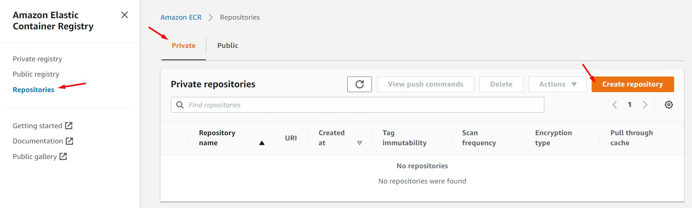
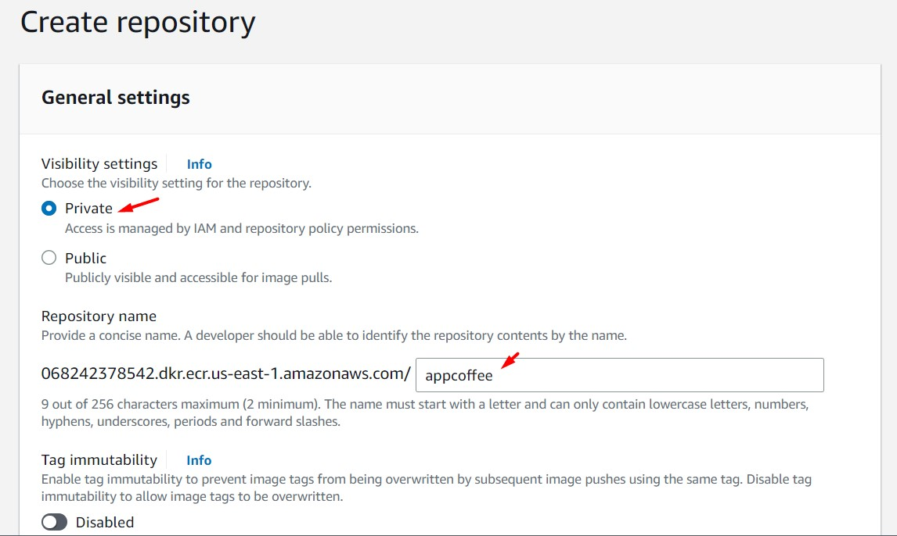
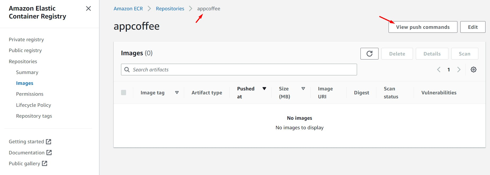
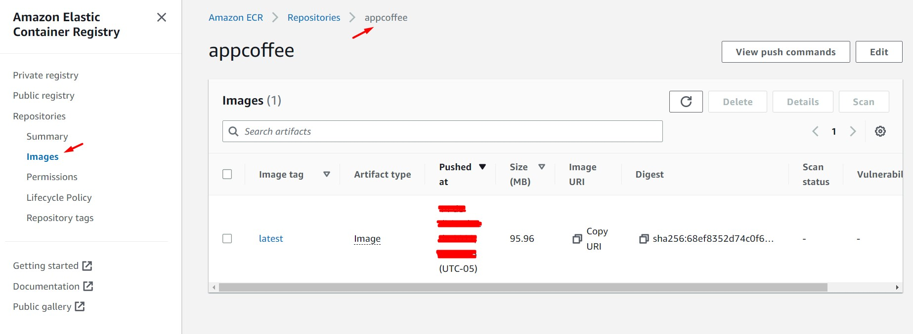
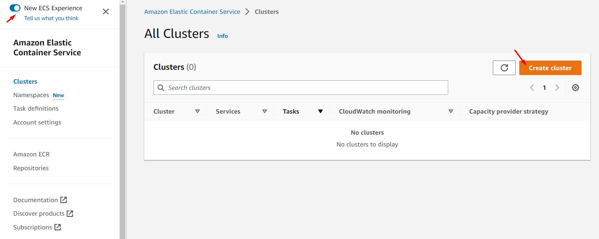
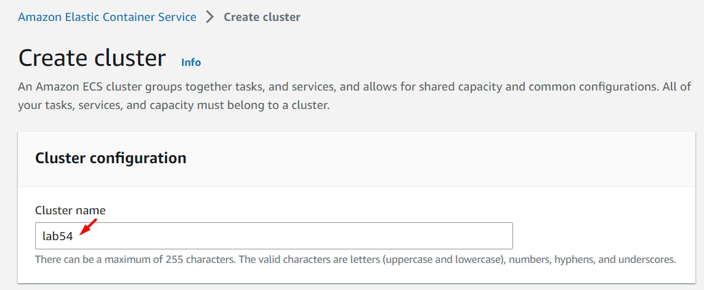
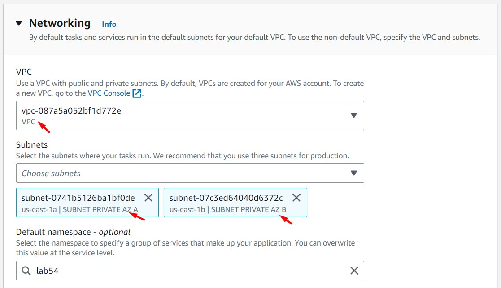
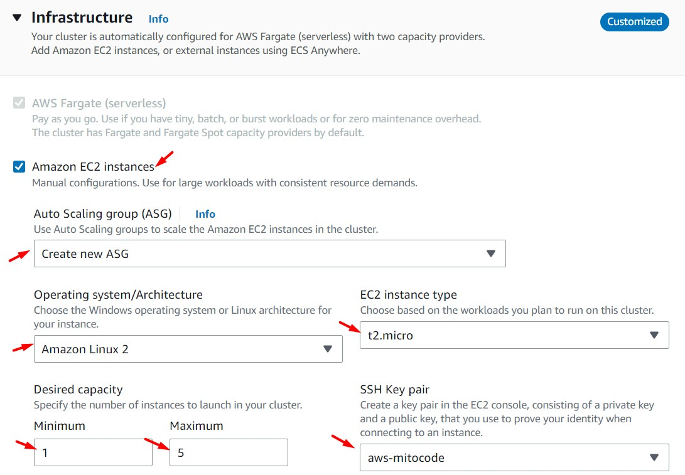
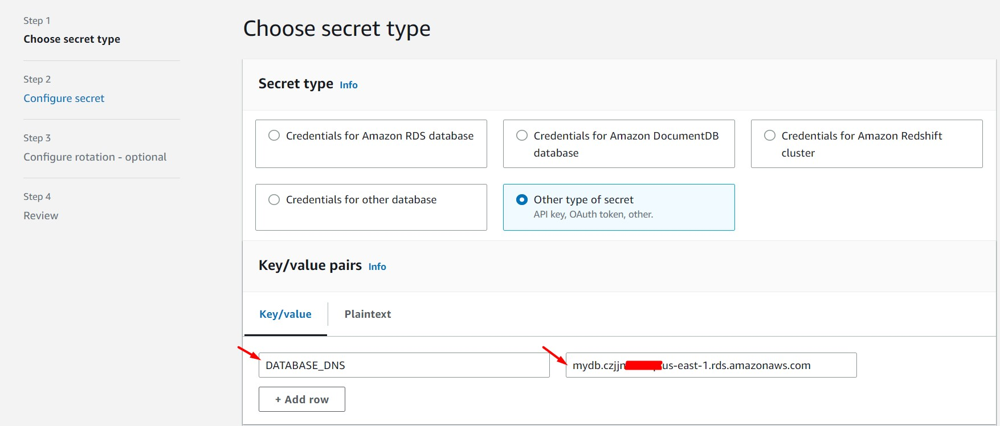
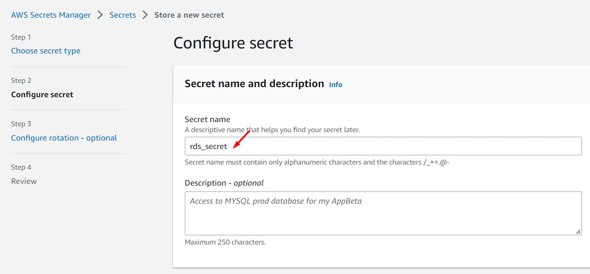

# AWS Solutions Architect Associate - Laboratorio 54

<br>

### Objetivo: 
* Uso del servicio ECR (Elastic Container Registry) y upload de una imagen Docker
* Creación de un cluster ECS-EC2 (Elastic Container Services) y uso de un task definition y services

### Tópico:
* Container

### Dependencias:
* Ninguna

<br>

---

### A - Uso del servicio ECR (Elastic Container Registry) y upload de una imagen Docker

<br>

<br>

1. Acceder al servicio AWS Cloud9 y generar un nuevo (o encender nuestro) ambiente de trabajo (Ubuntu 18.04 LTS)

2. Ejecutar los siguientes comandos en nuestro Cloud9

```bash
#Ubuntu 18.04
sudo apt-get update
docker --version
git clone https://github.com/jbarreto7991/aws-solutionsarchitectassociate.git
```

3. Acceder al laboratorio 54 (Lab-54), carpeta "code" y desplegar la plantilla "1_lab54-vpc-alb-rds.yaml" vía CloudFormation usando AWSCLI. Esta plantilla contiene un parámetro de despliegue "Key Pair" el cual se deberá personalizar.

```bash
aws cloudformation create-stack --stack-name lab54-vpc-alb-rds --template-body file://~/environment/aws-solutionsarchitectassociate/Lab-54/code/1_lab54-vpc-alb-rds.yaml --parameters ParameterKey=KeyPair,ParameterValue="aws-solutionsarchitectassociate" --capabilities CAPABILITY_IAM
```

4. Desde Cloud9, copiamos el proyecto "App-coffee" y los archivos "Dockerfile" y "docker-entrypoint.sh" a nuestro directorio de trabajo "enviroment/App-coffee"

```bash
mkdir ~/environment/App-coffee
cd ~/environment/App-coffee
cp -r ~/environment/aws-solutionsarchitectassociate/App-coffee/* .
cp ~/environment/aws-solutionsarchitectassociate/Lab-54/code/docker-entrypoint.sh .
cp ~/environment/aws-solutionsarchitectassociate/Lab-54/code/Dockerfile .
```

<br>

5. Procedemos a crear la imagen Docker y validar su correcta creación

```bash
#Comando: Creación de la imagen Docker
docker build -t app-coffee .

#Response
Sending build context to Docker daemon  1.634MB
Step 1/16 : FROM ubuntu:18.04
 ---> 251b86c83674
Step 2/16 : ENV TZ=America/Lima
 ---> Using cache
 ---> d722f4994cba
Step 3/16 : ENV APACHE_RUN_USER www-data
 ---> Using cache
 ---> 2a7a17bbe1bb
Step 4/16 : ENV APACHE_RUN_GROUP www-data
 ---> Using cache
 ---> e232b2fed41f
Step 5/16 : ENV APACHE_LOG_DIR /var/log/apache2
 ---> Using cache
 ---> f93b9b5d61f5
Step 6/16 : ENV APACHE_RUN_DIR /var/run/apache2
 ---> Using cache
 ---> 88e0e5bdb368
Step 7/16 : ENV APACHE_LOCK_DIR /var/lock/apache2
 ---> Using cache
 ---> 8cde7f26a761
Step 8/16 : ENV APACHE_SERVERADMIN admin@localhost
 ---> Using cache
 ---> 3c86e8f8f2e6
Step 9/16 : ENV APACHE_SERVERNAME localhost
 ---> Using cache
 ---> eff784b2f042
Step 10/16 : ENV APACHE_DOCUMENTROOT /var/www/html
 ---> Using cache
 ---> cd122d5743be
Step 11/16 : RUN ln -snf /usr/share/zoneinfo/$TZ /etc/localtime && echo $TZ > /etc/timezone &&     apt-get update &&     apt-get install php libapache2-mod-php -y &&     apt-get install php-mysqli -y
 ---> Using cache
 ---> 598d5c66bc5f
Step 12/16 : COPY . /var/www/html/
 ---> cf1f6383974a
Step 13/16 : RUN chmod +x /var/www/html/Model/CoffeeModel.php
 ---> Running in 03ac6108cd49
Removing intermediate container 03ac6108cd49
 ---> 8d72f391bcfd
Step 14/16 : RUN chmod +x /var/www/html/docker-entrypoint.sh
 ---> Running in 52865303e1b2
Removing intermediate container 52865303e1b2
 ---> 9fc734141010
Step 15/16 : ENTRYPOINT ["/var/www/html/docker-entrypoint.sh"]
 ---> Running in aa62bd63bed2
Removing intermediate container aa62bd63bed2
 ---> 670ca097861f
Step 16/16 : EXPOSE 80
 ---> Running in 5f4cf8f4adcd
Removing intermediate container 5f4cf8f4adcd
 ---> 0083f471302b
Successfully built 0083f471302b
Successfully tagged app-coffee:latest

#Comando: Verificación que la imagen Docker se ha creado correctamente
docker images --filter reference=app-coffee

#Response
REPOSITORY   TAG       IMAGE ID       CREATED         SIZE
app-coffee   latest    0083f471302b   7 seconds ago   225MB
```

<br>

6. Desde la consola de AWS, accedemos al servicio ECR (Elastic Container Registry), opción "Repositories". Luego, accedemos a la opción "Private" y finalmente damos clic en el botón "Create repository". Ingresamos/seleccionamos los siguientes valores y procedemos a dar clic en el botón "Create repository"

    * Visibility settings: Private
    * Repository name: appcoffee

<br>



<br>



<br>

7. Ingresamos al repositorio privado previamente creado y damos clic en el botón "View push commands". Copiamos los comandos indicados y los ejecutamos desde Cloud9. Reemplazar el valor "XXXXXXXXXXXX" por el ID respectivo de nuestra cuenta. Validar que nuestra imagen se encuentra en el servicio ECR.

```bash
#Comando: Recuperar un token de autenticación y autenticar el cliente Docker en ECR
aws ecr get-login-password --region us-east-1 | docker login --username AWS --password-stdin XXXXXXXXXXXX.dkr.ecr.us-east-1.amazonaws.com

#Respuesta
WARNING! Your password will be stored unencrypted in /home/ubuntu/.docker/config.json.
Configure a credential helper to remove this warning. See
https://docs.docker.com/engine/reference/commandline/login/#credentials-store
Login Succeeded

#Comando - Identificar el nombre de nuestra imagen local
docker images
#Respuesta
REPOSITORY   TAG       IMAGE ID       CREATED             SIZE
app-coffee   latest    0083f471302b   About an hour ago   225MB
<none>       <none>    67a593657d07   About an hour ago   225MB
<none>       <none>    c2120eaa794e   About an hour ago   223MB
ubuntu       18.04     251b86c83674   5 days ago          63.1MB

#Comando: Etiquetar la imagen generada en el paso 5
docker tag app-coffee:latest XXXXXXXXXXXX.dkr.ecr.us-east-1.amazonaws.com/appcoffee:latest

#Comando - Identificar el nombre de nuestra nueva imagen
docker images
#Respuesta
REPOSITORY                                               TAG       IMAGE ID       CREATED             SIZE
XXXXXXXXXXXX.dkr.ecr.us-east-1.amazonaws.com/appcoffee   latest    0083f471302b   About an hour ago   225MB
app-coffee                                               latest    0083f471302b   About an hour ago   225MB
<none>                                                   <none>    67a593657d07   About an hour ago   225MB
<none>                                                   <none>    c2120eaa794e   About an hour ago   223MB
ubuntu                                                   18.04     251b86c83674   5 days ago          63.1MB

#Comando: 
docker push XXXXXXXXXXXX.dkr.ecr.us-east-1.amazonaws.com/appcoffee:latest

#Respuesta
The push refers to repository [XXXXXXXXXXXX.dkr.ecr.us-east-1.amazonaws.com/appcoffee]
5a4c71263e45: Pushed 
cf44208f9745: Pushed 
b0e0787c26b5: Pushed 
511cad7ce74e: Pushed 
45bbe3d22998: Pushed 
latest: digest: sha256:68ef8352d74c0f6715b14e3b9430dfcb5f529107ba222411c032aa990da4858a size: 1366
```

<br>



<br>



<br>

8. Accedemos al servicio ECS (Elastic Container Service) y damos clic en el botón "Create Cluster". Ingresamos/seleccionamos los siguientes valores. Luego, dar clic en el botón "Create".

    * **Cluster Configuration**
        * Cluster name: lab54
    * **Networking**
        * VPC: Seleccionamos vpc VPC
        * Subnets: Seleccionamos SUBNET PRIVATE AZ A y SUBNET PRIVATE AZ B
    * **Infraestructure**
        * Amazon EC2 Instances: On
        * Auto Scaling group (ASG): Create new AG
        * Operating system/Architecture: Amazon Linux 2
        * EC2 instance type: t2.micro
        * Desired capacity:
            * Minimum: 1
            * Maximum: 5
        * SSH Key pair: Seleccionar Key Pair

<br>



<br>



<br>



<br>



<br>

9. Desde el servicio "Secrets Manager" generamos el siguiente secreto. Dar clic en "Store a new secret". Ingresar/seleccionar los siguientes valores en las secciones "Secret Type" y "Secret name and description", considerar los demás valores por defecto.

    * **Secret Type**
        * Key: DATABASE_DNS
        * Value: "Ingresar el DNS Endpoint de nuestro RDS"
        * Encryption key: aws/secretsmanager
    * **Secret name and description**
        * Secret name: rds_secret

<br>



<br>



<br>

10. Acceder a nuestro secreto "rds_secret" y copiar el valor de "Secret ARN". Este valor será usado en pasos posteriores y se representará a través de la variable "SECRETS_MANAGER_ARN".

<br>

11. Acceder al servicio IAM y generar la siguiente política. Usar como valor del campo "Name" a "secrets_manager_ecs"

```bash
{
  "Version": "2012-10-17",
  "Statement": [
    {
      "Effect": "Allow",
      "Action": [
        "ssm:GetParameters",
        "secretsmanager:GetSecretValue"
      ],
      "Resource": [
        "${SECRETS_MANAGER_ARN}"
      ]
    }
  ]
}
```

12. Desde el servicio IAM, generar el siguiente rol. Este rol usará la siguiente relación de confianza para "ecs.tasks.amazonaws.com" y la política creada en el paso anterior. Además se asignará la siguiente política: "AmazonECSTaskExecutionRolePolicy"

    * Trusted entity type: Custom trust policy
    * Role name: secrets_manager_ecs

```bash
{
  "Version": "2012-10-17",
  "Statement": [
    {
      "Sid": "",
      "Effect": "Allow",
      "Principal": {
        "Service": "ecs-tasks.amazonaws.com"
      },
      "Action": "sts:AssumeRole"
    }
  ]
}
```

<br>

13. Generar el siguiente Task Definition. 
